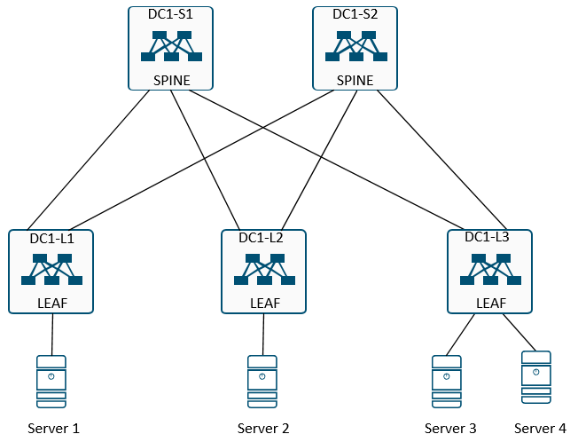
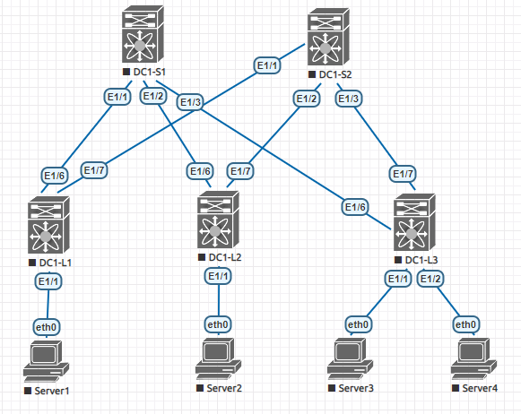

## Домашнее задание
Проектирование адресного пространства

Цель:
- Собрать схему CLOS;
- Распределить адресное пространство;

## IP Plan

Для DC1 выделяется подсеть <b> 10.0.0.0/12 </b>
Диапазон IP адресов <b> 10.10.0.1 - 10.15.255.254 </b>

### Правила распределения адресов

IP = 10.Dn.Sn.X/32, где:

|Параметр|Назначение|Диапазон|
|---|---|---|
Dn|номера сервисов внутри ЦОДа|0-15|
Sn|номер spine|1-255|
X|значение по порядку|1-255

где Dn:  
0 – loopback0 (router ID)  
1 – loopback1 (анонсируемый loopback) 
2 – p2p links 

### Распределение IP адресов

|Имя хоста|Тип хоста|Loopback0|Loopback1|
|---|---|---|---|
DC1-S1|Spine|10.0.0.1/32|10.1.0.1/32
DC1-S2|Spine|10.0.0.2/32|10.1.0.2/32
DC1-L1|Leaf|10.0.0.3/32|10.1.0.3/32
DC1-L2|Leaf|10.0.0.4/32|10.1.0.4/32
DC1-L3|Leaf|10.0.0.5/32|10.1.0.5/32

### PTP подсети. Линки между Spine и Leaf

|Имя хоста|DC1-S1|DC1-S2
|---|---|---|
DC1-L1|10.2.1.0/31|10.2.2.0/31
DC1-L2|10.2.1.2/31|10.2.2.2/31
DC1-L3|10.2.1.4/31|10.2.2.4/31

## Схема сети

## Выполнение домашней работы в EVE-NG

