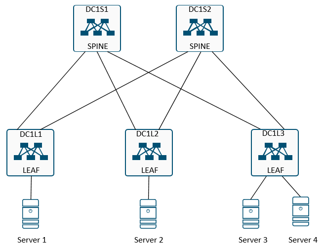

## Домашнее задание
Проектирование адресного пространства

Цель:
- Собрать схему CLOS;
- Распределить адресное пространство;

## IP Plan

Для DC1 выделяется подсеть <b> 10.0.0.0/12 </b>
Диапазон IP адресов <b> 10.10.0.1 - 10.15.255.254 </b>

IP = 10.Dn.Sn.X/31, где:

|Параметр|Назаначение|Диапазон|
|---|---|---|
Dn|номера ЦОДа|0-15|
Sn|номер spine|1-255|
X|значение по порядку|1-255

## Схема сети

