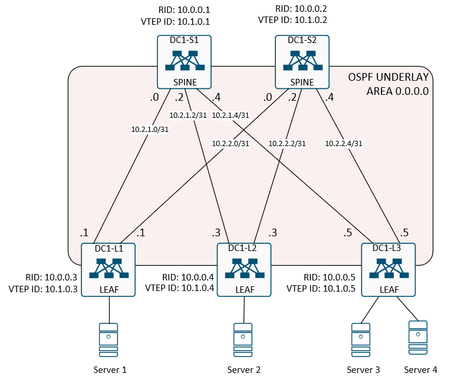

## Домашнее задание
Построение Underlay сети (OSPF)

Цель:
- Настроить первичные данные на коммутаторах;
- Сконфигурировать динамическую маршрутизацию на базе протокола OSPF.

## Схема сети



## Выполнение домашней работы в EVE-NG

<details>
<summary>Конфигурация коммутатора <b>DC1-S1</b>: </summary>

```
hostname DC1-S1
feature ospf

no password strength-check
username admin password 5 $5$EpjWybJm$5mpj3jo3pEmSllAwFICLfBi/7uvJmNQ0eheQXqc75kD  role network-admin
no ip domain-lookup
ip domain-name demo.lab

key chain OSPF
  key 0
    key-string 7 075e731f1a5c4f
vrf context management

interface Ethernet1/1
  description to DC1-L1
  no switchport
  no ip redirects
  ip address 10.2.1.0/31
  ip ospf authentication message-digest
  ip ospf authentication key-chain OSPF
  ip ospf network point-to-point
  ip router ospf UNDERLAY area 0.0.0.0
  no shutdown

interface Ethernet1/2
  description to DC1-L2
  no switchport
  no ip redirects
  ip address 10.2.1.2/31
  ip ospf authentication message-digest
  ip ospf authentication key-chain OSPF
  ip ospf network point-to-point
  ip router ospf UNDERLAY area 0.0.0.0
  no shutdown

interface Ethernet1/3
  description to DC1-L3
  no switchport
  no ip redirects
  ip address 10.2.1.4/31
  ip ospf authentication message-digest
  ip ospf authentication key-chain OSPF
  ip ospf network point-to-point
  ip router ospf UNDERLAY area 0.0.0.0
  no shutdown

interface loopback0
  description RID
  ip address 10.0.0.1/32
  ip ospf network point-to-point
  ip router ospf UNDERLAY area 0.0.0.0

interface loopback1
  description VTEP
  ip address 10.1.0.1/32
  ip ospf network point-to-point
  ip router ospf UNDERLAY area 0.0.0.0
line console
line vty
boot nxos bootflash:/nxos.9.2.2.bin
router ospf UNDERLAY
  router-id 10.0.0.1
```
</details>

<details>
<summary>Конфигурация коммутатора <b>DC1-S2</b>: </summary>
```
hostname DC1-S2
feature ospf

no password strength-check
username admin password 5 $5$KTDEXqgq$L8xkct2JY9ERGiltil5uKPeCrvcHgLBTOJkxfhnk6XA  role network-admin
no ip domain-lookup
ip domain-name demo.lab

key chain OSPF
  key 0
    key-string 7 075e731f1a5c4f
vrf context management

interface Ethernet1/1
  description to DC1-L1
  no switchport
  no ip redirects
  ip address 10.2.2.0/31
  ip ospf authentication message-digest
  ip ospf authentication key-chain OSPF
  ip ospf network point-to-point
  ip router ospf UNDERLAY area 0.0.0.0
  no shutdown

interface Ethernet1/2
  description to DC1-L2
  no switchport
  no ip redirects
  ip address 10.2.2.2/31
  ip ospf authentication message-digest
  ip ospf authentication key-chain OSPF
  ip ospf network point-to-point
  ip router ospf UNDERLAY area 0.0.0.0
  no shutdown

interface Ethernet1/3
  description to DC1-L3
  no switchport
  no ip redirects
  ip address 10.2.2.4/31
  ip ospf authentication message-digest
  ip ospf authentication key-chain OSPF
  ip ospf network point-to-point
  ip router ospf UNDERLAY area 0.0.0.0
  no shutdown

interface loopback0
  description RID
  ip address 10.0.0.2/32
  ip ospf network point-to-point
  ip router ospf UNDERLAY area 0.0.0.0

interface loopback1
  description VTEP
  ip address 10.1.0.2/32
  ip ospf network point-to-point
  ip router ospf UNDERLAY area 0.0.0.0
line console
line vty
boot nxos bootflash:/nxos.9.2.2.bin
router ospf UNDERLAY
  router-id 10.0.0.2
```
</details>

<details>
<summary>Конфигурация коммутатора <b>DC1-L1</b>: </summary>

```
```
</details>

<details>
<summary>Конфигурация коммутатора <b>DC1-L2</b>: </summary>

```
```
</details>

<details>
<summary>Конфигурация коммутатора <b>DC1-L3</b>: </summary>

```
```
</details>