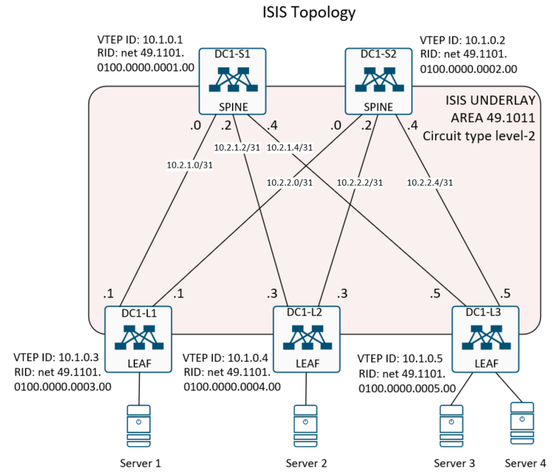

## Домашнее задание
Построение Underlay сети (ISIS)

Цель:
- Сконфигурировать динамическую маршрутизацию на базе протокола ISIS;
- Проверить динамическую маршрутизацию и доступность VTEP ID на соседних узлах.

## Схема сети



## Выполнение домашней работы в EVE-NG

### Настройка коммутаторов

<details>
<summary>Конфигурация коммутатора <b>DC1-S1</b>: </summary>

```
feature isis

key chain ISIS
  key 0
    key-string 7 075e731f1a5c4f
    
router isis UNDERLAY
  net 49.1101.0100.0000.0001.00
  metric-style transition
  authentication key-chain ISIS level-2
    
interface Ethernet1/1
  description to DC1-L1
  no switchport
  no ip redirects
  ip address 10.2.1.0/31
  ip router isis UNDERLAY
  isis circuit-type level-2
  no shutdown

interface Ethernet1/2
  description to DC1-L2
  no switchport
  no ip redirects
  ip address 10.2.1.2/31
  ip router isis UNDERLAY
  isis circuit-type level-2
  no shutdown

interface Ethernet1/3
  description to DC1-L3
  no switchport
  no ip redirects
  ip address 10.2.1.4/31
  ip router isis UNDERLAY
  isis circuit-type level-2
  no shutdown

interface loopback0
  description RID
  ip address 10.0.0.1/32

interface loopback1
  description VTEP
  ip address 10.1.0.1/32
  ip router isis UNDERLAY

```
</details>


<details>
<summary>Конфигурация коммутатора <b>DC1-S2</b>: </summary>

```

hostname DC1-S2
feature isis

key chain ISIS
  key 0
    key-string 7 075e731f1a5c4f
    
router isis UNDERLAY
  net 49.1101.0100.0000.0002.00
  metric-style transition
  authentication key-chain ISIS level-2

interface Ethernet1/1
  description to DC1-L1
  no switchport
  no ip redirects
  ip address 10.2.2.0/31
  ip router isis UNDERLAY
  isis circuit-type level-2
  no shutdown

interface Ethernet1/2
  description to DC1-L2
  no switchport
  no ip redirects
  ip address 10.2.2.2/31
  ip router isis UNDERLAY
  isis circuit-type level-2
  no shutdown

interface Ethernet1/3
  description to DC1-L3
  no switchport
  no ip redirects
  ip address 10.2.2.4/31
  ip router isis UNDERLAY
  isis circuit-type level-2
  no shutdown

interface loopback0
  description RID
  ip address 10.0.0.2/32

interface loopback1
  description VTEP
  ip address 10.1.0.2/32
  ip router isis UNDERLAY

```
</details>


<details>
<summary>Конфигурация коммутатора <b>DC1-L1</b>: </summary>

```
hostname DC1-L1
feature isis

key chain ISIS
  key 0
    key-string 7 075e731f1a5c4f
    
router isis UNDERLAY
  net 49.1101.0100.0000.0003.00
  metric-style transition
  authentication key-chain ISIS level-2

interface Ethernet1/6
  description to DC1-S1
  no switchport
  no ip redirects
  ip address 10.2.1.1/31
  ip router isis UNDERLAY
  isis circuit-type level-2
  no shutdown

interface Ethernet1/7
  description to DC1-S2
  no switchport
  no ip redirects
  ip address 10.2.2.1/31
  ip router isis UNDERLAY
  isis circuit-type level-2  no shutdown

interface loopback0
  description RID
  ip address 10.0.0.3/32

interface loopback1
  description VTEP
  ip address 10.1.0.3/32
  ip router isis UNDERLAY

```
</details>

<details>
<summary>Конфигурация коммутатора <b>DC1-L2</b>: </summary>

```
hostname DC1-L2
feature isis

key chain ISIS
  key 0
    key-string 7 075e731f1a5c4f
    
router isis UNDERLAY
  net 49.1101.0100.0000.0004.00
  metric-style transition
  authentication key-chain ISIS level-2
  
  interface Ethernet1/6
  description to DC1-S1
  no switchport
  no ip redirects
  ip address 10.2.1.3/31
  ip router isis UNDERLAY
  isis circuit-type level-2
  no shutdown

interface Ethernet1/7
  description to DC1-S2
  no switchport
  no ip redirects
  ip address 10.2.2.3/31
  ip router isis UNDERLAY
  isis circuit-type level-2
  no shutdown

interface loopback0
  description RID
  ip address 10.0.0.4/32

interface loopback1
  description VTEP
  ip address 10.1.0.4/32
  ip router isis UNDERLAY
  no shut

```
</details>

<details>
<summary>Конфигурация коммутатора <b>DC1-L3</b>: </summary>

```
hostname DC1-L3
feature ospf

key chain ISIS
  key 0
    key-string 7 075e731f1a5c4f
    
router isis UNDERLAY
  net 49.1101.0100.0000.0005.00
  metric-style transition
  authentication key-chain ISIS level-2
  
interface Ethernet1/6
  description to DC1-S1
  no switchport
  no ip redirects
  ip address 10.2.1.5/31
  ip router isis UNDERLAY
  isis circuit-type level-2
  no shutdown

interface Ethernet1/7
  description to DC1-S2
  no switchport
  no ip redirects
  ip address 10.2.2.5/31
  ip router isis UNDERLAY
  isis circuit-type level-2
  no shutdown

interface loopback0
  description RID
  ip address 10.0.0.5/32
 
interface loopback1
  description VTEP
  ip address 10.1.0.5/32
  ip router isis UNDERLAY

```
</details>

### Проверка маршрутизации

Проверка ISIS на коммутаторе <b>DC1-L1</b>:
```
DC1-L1# sh isis adj
IS-IS process: UNDERLAY VRF: default
IS-IS adjacency database:
Legend: '!': No AF level connectivity in given topology
System ID       SNPA            Level  State  Hold Time  Interface
DC1-S1          5000.0001.0007  2      UP     00:00:28   Ethernet1/6
DC1-S2          5000.0002.0007  2      UP     00:00:21   Ethernet1/7

DC1-L1# sh ip ro isis
IP Route Table for VRF "default"
'*' denotes best ucast next-hop
'**' denotes best mcast next-hop
'[x/y]' denotes [preference/metric]
'%<string>' in via output denotes VRF <string>

10.1.0.1/32, ubest/mbest: 1/0
    *via 10.2.1.0, Eth1/6, [115/41], 19:42:46, isis-UNDERLAY, L2
10.1.0.2/32, ubest/mbest: 1/0
    *via 10.2.2.0, Eth1/7, [115/41], 03:23:34, isis-UNDERLAY, L2
10.1.0.4/32, ubest/mbest: 2/0
    *via 10.2.1.0, Eth1/6, [115/81], 05:42:52, isis-UNDERLAY, L2
    *via 10.2.2.0, Eth1/7, [115/81], 03:30:40, isis-UNDERLAY, L2
10.1.0.5/32, ubest/mbest: 2/0
    *via 10.2.1.0, Eth1/6, [115/81], 03:23:48, isis-UNDERLAY, L2
    *via 10.2.2.0, Eth1/7, [115/81], 03:23:48, isis-UNDERLAY, L2
10.2.1.2/31, ubest/mbest: 1/0
    *via 10.2.1.0, Eth1/6, [115/80], 06:00:17, isis-UNDERLAY, L2
10.2.1.4/31, ubest/mbest: 1/0
    *via 10.2.1.0, Eth1/6, [115/80], 06:00:02, isis-UNDERLAY, L2
10.2.2.2/31, ubest/mbest: 1/0
    *via 10.2.2.0, Eth1/7, [115/80], 03:30:40, isis-UNDERLAY, L2
10.2.2.4/31, ubest/mbest: 1/0
    *via 10.2.2.0, Eth1/7, [115/80], 03:30:35, isis-UNDERLAY, L2

DC1-L1# ping 10.1.0.5 count 2
PING 10.1.0.5 (10.1.0.5): 56 data bytes
64 bytes from 10.1.0.5: icmp_seq=0 ttl=253 time=27.281 ms
64 bytes from 10.1.0.5: icmp_seq=1 ttl=253 time=9.503 ms

--- 10.1.0.5 ping statistics ---
2 packets transmitted, 2 packets received, 0.00% packet loss
round-trip min/avg/max = 9.503/18.391/27.281 ms
DC1-L1#

```
Проверка OSPF на коммутаторе<b> DC1-L2</b>:
```
DDC1-L2# sh isis adj
IS-IS process: UNDERLAY VRF: default
IS-IS adjacency database:
Legend: '!': No AF level connectivity in given topology
System ID       SNPA            Level  State  Hold Time  Interface
DC1-S1          5000.0001.0007  2      UP     00:00:23   Ethernet1/6
DC1-S2          5000.0002.0007  2      UP     00:00:33   Ethernet1/7

DC1-L2# sh ip ro isis
IP Route Table for VRF "default"
'*' denotes best ucast next-hop
'**' denotes best mcast next-hop
'[x/y]' denotes [preference/metric]
'%<string>' in via output denotes VRF <string>

10.1.0.1/32, ubest/mbest: 1/0
    *via 10.2.1.2, Eth1/6, [115/41], 05:50:18, isis-UNDERLAY, L2
10.1.0.2/32, ubest/mbest: 1/0
    *via 10.2.2.2, Eth1/7, [115/41], 03:27:27, isis-UNDERLAY, L2
10.1.0.3/32, ubest/mbest: 2/0
    *via 10.2.1.2, Eth1/6, [115/81], 05:50:17, isis-UNDERLAY, L2
    *via 10.2.2.2, Eth1/7, [115/81], 03:34:33, isis-UNDERLAY, L2
10.1.0.5/32, ubest/mbest: 2/0
    *via 10.2.1.2, Eth1/6, [115/81], 03:27:41, isis-UNDERLAY, L2
    *via 10.2.2.2, Eth1/7, [115/81], 03:27:41, isis-UNDERLAY, L2
10.2.1.0/31, ubest/mbest: 1/0
    *via 10.2.1.2, Eth1/6, [115/80], 05:50:18, isis-UNDERLAY, L2
10.2.1.4/31, ubest/mbest: 1/0
    *via 10.2.1.2, Eth1/6, [115/80], 05:50:18, isis-UNDERLAY, L2
10.2.2.0/31, ubest/mbest: 1/0
    *via 10.2.2.2, Eth1/7, [115/80], 03:34:33, isis-UNDERLAY, L2
10.2.2.4/31, ubest/mbest: 1/0
    *via 10.2.2.2, Eth1/7, [115/80], 03:34:29, isis-UNDERLAY, L2

DC1-L2# ping 10.1.0.5
PING 10.1.0.5 (10.1.0.5): 56 data bytes
64 bytes from 10.1.0.5: icmp_seq=0 ttl=253 time=26.868 ms
64 bytes from 10.1.0.5: icmp_seq=1 ttl=253 time=6.487 ms
64 bytes from 10.1.0.5: icmp_seq=2 ttl=253 time=7.886 ms
64 bytes from 10.1.0.5: icmp_seq=3 ttl=253 time=14.912 ms
64 bytes from 10.1.0.5: icmp_seq=4 ttl=253 time=7.769 ms

--- 10.1.0.5 ping statistics ---
5 packets transmitted, 5 packets received, 0.00% packet loss
round-trip min/avg/max = 6.487/12.784/26.868 ms
DC1-L2#

```

Проверка OSPF на коммутаторе <b>DC1-L3</b>:
```
DC1-L3# sh isis adj
IS-IS process: UNDERLAY VRF: default
IS-IS adjacency database:
Legend: '!': No AF level connectivity in given topology
System ID       SNPA            Level  State  Hold Time  Interface
DC1-S1          5000.0001.0007  2      UP     00:00:27   Ethernet1/6
DC1-S2          5000.0002.0007  2      UP     00:00:26   Ethernet1/7

DC1-L3# sh ip ro isis
IP Route Table for VRF "default"
'*' denotes best ucast next-hop
'**' denotes best mcast next-hop
'[x/y]' denotes [preference/metric]
'%<string>' in via output denotes VRF <string>

10.1.0.1/32, ubest/mbest: 1/0
    *via 10.2.1.4, Eth1/6, [115/41], 04:04:06, isis-UNDERLAY, L2
10.1.0.2/32, ubest/mbest: 1/0
    *via 10.2.2.4, Eth1/7, [115/41], 03:28:38, isis-UNDERLAY, L2
10.1.0.3/32, ubest/mbest: 2/0
    *via 10.2.1.4, Eth1/6, [115/81], 04:04:05, isis-UNDERLAY, L2
    *via 10.2.2.4, Eth1/7, [115/81], 03:35:39, isis-UNDERLAY, L2
10.1.0.4/32, ubest/mbest: 2/0
    *via 10.2.1.4, Eth1/6, [115/81], 04:04:05, isis-UNDERLAY, L2
    *via 10.2.2.4, Eth1/7, [115/81], 03:35:39, isis-UNDERLAY, L2
10.2.1.0/31, ubest/mbest: 1/0
    *via 10.2.1.4, Eth1/6, [115/80], 04:04:06, isis-UNDERLAY, L2
10.2.1.2/31, ubest/mbest: 1/0
    *via 10.2.1.4, Eth1/6, [115/80], 04:04:06, isis-UNDERLAY, L2
10.2.2.0/31, ubest/mbest: 1/0
    *via 10.2.2.4, Eth1/7, [115/80], 03:35:39, isis-UNDERLAY, L2
10.2.2.2/31, ubest/mbest: 1/0
    *via 10.2.2.4, Eth1/7, [115/80], 03:35:39, isis-UNDERLAY, L2

DC1-L3# ping 10.1.0.3
PING 10.1.0.3 (10.1.0.3): 56 data bytes
64 bytes from 10.1.0.3: icmp_seq=0 ttl=253 time=29.206 ms
64 bytes from 10.1.0.3: icmp_seq=1 ttl=253 time=9.916 ms
64 bytes from 10.1.0.3: icmp_seq=2 ttl=253 time=5.31 ms
64 bytes from 10.1.0.3: icmp_seq=3 ttl=253 time=8.332 ms
64 bytes from 10.1.0.3: icmp_seq=4 ttl=253 time=9.023 ms

--- 10.1.0.3 ping statistics ---
5 packets transmitted, 5 packets received, 0.00% packet loss
round-trip min/avg/max = 5.31/12.357/29.206 ms
DC1-L3#

```

Проверка OSPF на коммутаторе <b>DC1-S1</b>:
```
DC1-S1# sh isis adj
IS-IS process: UNDERLAY VRF: default
IS-IS adjacency database:
Legend: '!': No AF level connectivity in given topology
System ID       SNPA            Level  State  Hold Time  Interface
DC1-L1          5000.0003.0007  2      UP     00:00:08   Ethernet1/1
DC1-L2          5000.0004.0007  2      UP     00:00:08   Ethernet1/2
DC1-L3          5000.0005.0007  2      UP     00:00:06   Ethernet1/3

DC1-S1# sh ip ro isis
IP Route Table for VRF "default"
'*' denotes best ucast next-hop
'**' denotes best mcast next-hop
'[x/y]' denotes [preference/metric]
'%<string>' in via output denotes VRF <string>

10.1.0.2/32, ubest/mbest: 3/0
    *via 10.2.1.1, Eth1/1, [115/81], 03:30:05, isis-UNDERLAY, L2
    *via 10.2.1.3, Eth1/2, [115/81], 03:30:05, isis-UNDERLAY, L2
    *via 10.2.1.5, Eth1/3, [115/81], 03:30:05, isis-UNDERLAY, L2
10.1.0.3/32, ubest/mbest: 1/0
    *via 10.2.1.1, Eth1/1, [115/41], 19:49:56, isis-UNDERLAY, L2
10.1.0.4/32, ubest/mbest: 1/0
    *via 10.2.1.3, Eth1/2, [115/41], 05:49:23, isis-UNDERLAY, L2
10.1.0.5/32, ubest/mbest: 1/0
    *via 10.2.1.5, Eth1/3, [115/41], 03:30:19, isis-UNDERLAY, L2
10.2.2.0/31, ubest/mbest: 1/0
    *via 10.2.1.1, Eth1/1, [115/80], 04:12:11, isis-UNDERLAY, L2
10.2.2.2/31, ubest/mbest: 1/0
    *via 10.2.1.3, Eth1/2, [115/80], 05:52:19, isis-UNDERLAY, L2
10.2.2.4/31, ubest/mbest: 1/0
    *via 10.2.1.5, Eth1/3, [115/80], 04:05:28, isis-UNDERLAY, L2

DC1-S1# ping 10.1.0.2
PING 10.1.0.2 (10.1.0.2): 56 data bytes
64 bytes from 10.1.0.2: icmp_seq=0 ttl=253 time=23.935 ms
64 bytes from 10.1.0.2: icmp_seq=1 ttl=253 time=7.797 ms
64 bytes from 10.1.0.2: icmp_seq=2 ttl=253 time=5.375 ms
64 bytes from 10.1.0.2: icmp_seq=3 ttl=253 time=5.459 ms
64 bytes from 10.1.0.2: icmp_seq=4 ttl=253 time=5.291 ms

--- 10.1.0.2 ping statistics ---
5 packets transmitted, 5 packets received, 0.00% packet loss
round-trip min/avg/max = 5.291/9.571/23.935 ms
DC1-S1#

```

Проверка OSPF на коммутаторе <b>DC1-S2</b>:
```
DC1-S2# sh isis adj
IS-IS process: UNDERLAY VRF: default
IS-IS adjacency database:
Legend: '!': No AF level connectivity in given topology
System ID       SNPA            Level  State  Hold Time  Interface
DC1-L1          5000.0003.0007  2      UP     00:00:09   Ethernet1/1
DC1-L2          5000.0004.0007  2      UP     00:00:08   Ethernet1/2
DC1-L3          5000.0005.0007  2      UP     00:00:08   Ethernet1/3

DC1-S2# sh ip ro isis
IP Route Table for VRF "default"
'*' denotes best ucast next-hop
'**' denotes best mcast next-hop
'[x/y]' denotes [preference/metric]
'%<string>' in via output denotes VRF <string>

10.1.0.1/32, ubest/mbest: 3/0
    *via 10.2.2.1, Eth1/1, [115/81], 03:39:23, isis-UNDERLAY, L2
    *via 10.2.2.3, Eth1/2, [115/81], 03:39:17, isis-UNDERLAY, L2
    *via 10.2.2.5, Eth1/3, [115/81], 03:39:11, isis-UNDERLAY, L2
10.1.0.3/32, ubest/mbest: 1/0
    *via 10.2.2.1, Eth1/1, [115/41], 03:39:26, isis-UNDERLAY, L2
10.1.0.4/32, ubest/mbest: 1/0
    *via 10.2.2.3, Eth1/2, [115/41], 03:39:17, isis-UNDERLAY, L2
10.1.0.5/32, ubest/mbest: 1/0
    *via 10.2.2.5, Eth1/3, [115/41], 03:32:25, isis-UNDERLAY, L2
10.2.1.0/31, ubest/mbest: 1/0
    *via 10.2.2.1, Eth1/1, [115/80], 03:39:26, isis-UNDERLAY, L2
10.2.1.2/31, ubest/mbest: 1/0
    *via 10.2.2.3, Eth1/2, [115/80], 03:39:17, isis-UNDERLAY, L2
10.2.1.4/31, ubest/mbest: 1/0
    *via 10.2.2.5, Eth1/3, [115/80], 03:39:11, isis-UNDERLAY, L2

DC1-S2# ping 10.1.0.1
PING 10.1.0.1 (10.1.0.1): 56 data bytes
64 bytes from 10.1.0.1: icmp_seq=0 ttl=253 time=27.402 ms
64 bytes from 10.1.0.1: icmp_seq=1 ttl=253 time=6.043 ms
64 bytes from 10.1.0.1: icmp_seq=2 ttl=253 time=5.674 ms
64 bytes from 10.1.0.1: icmp_seq=3 ttl=253 time=5.629 ms
64 bytes from 10.1.0.1: icmp_seq=4 ttl=253 time=26.207 ms

--- 10.1.0.1 ping statistics ---
5 packets transmitted, 5 packets received, 0.00% packet loss
round-trip min/avg/max = 5.629/14.19/27.402 ms
DC1-S2#


```