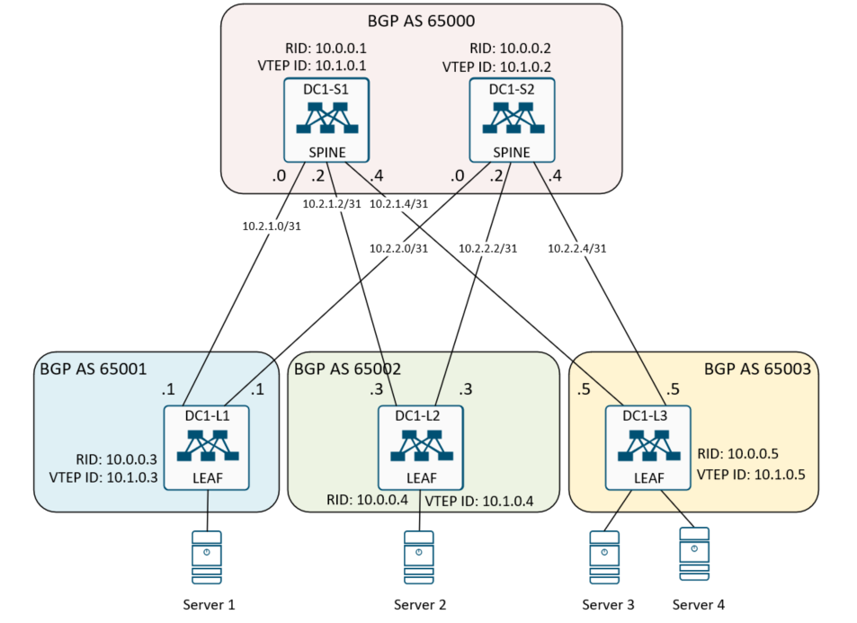

## Домашнее задание
Построение Underlay сети (BGP)

Цель:
- Сконфигурировать динамическую маршрутизацию на базе протокола BGP;
- Проверить динамическую маршрутизацию и доступность Loopback0 на коммутатора LEAF.

## Схема сети



## Выполнение домашней работы в EVE-NG

### Настройка коммутаторов

<details>
<summary>Конфигурация коммутатора <b>DC1-S1</b>: </summary>

```
hostname DC1-S1
feature bgp

interface Ethernet1/1
  description to DC1-L1
  no switchport
  no ip redirects
  ip address 10.2.1.0/31
  no shutdown

interface Ethernet1/2
  description to DC1-L2
  no switchport
  no ip redirects
  ip address 10.2.1.2/31
  no shutdown

interface Ethernet1/3
  description to DC1-L3
  no switchport
  no ip redirects
  ip address 10.2.1.4/31
  no shutdown

interface loopback0
  description RID
  ip address 10.0.0.1/32

interface loopback1
  description VTEP
  ip address 10.1.0.1/32

router bgp 65000
  router-id 10.0.0.1
  bestpath as-path multipath-relax
  address-family ipv4 unicast
    maximum-paths 64
  neighbor 10.2.1.1
    remote-as 65001
    description DC1-L1
    timers 3 9
    address-family ipv4 unicast
  neighbor 10.2.1.3
    remote-as 65002
    description DC1-L2
    timers 3 9
    address-family ipv4 unicast
  neighbor 10.2.1.5
    remote-as 65003
    description DC1-L3
    timers 3 9
    address-family ipv4 unicast

```
</details>


<details>
<summary>Конфигурация коммутатора <b>DC1-S2</b>: </summary>

```
hostname DC1-S2
feature bgp

interface Ethernet1/1
  description to DC1-L1
  no switchport
  no ip redirects
  ip address 10.2.2.0/31
  no shutdown

interface Ethernet1/2
  description to DC1-L2
  no switchport
  no ip redirects
  ip address 10.2.2.2/31
  no shutdown

interface Ethernet1/3
  description to DC1-L3
  no switchport
  no ip redirects
  ip address 10.2.2.4/31
  no shutdown

interface loopback0
  description RID
  ip address 10.0.0.2/32

interface loopback1
  description VTEP
  ip address 10.1.0.2/32

router bgp 65000
  router-id 10.0.0.2
  bestpath as-path multipath-relax
  address-family ipv4 unicast
    maximum-paths 64
  neighbor 10.2.2.1
    remote-as 65001
    description DC1-L1
    timers 3 9
    address-family ipv4 unicast
  neighbor 10.2.2.3
    remote-as 65002
    description DC1-L2
    timers 3 9
    address-family ipv4 unicast
  neighbor 10.2.2.5
    remote-as 65003
    description DC1-L3
    timers 3 9
    address-family ipv4 unicast

```
</details>


<details>
<summary>Конфигурация коммутатора <b>DC1-L1</b>: </summary>

```
hostname DC1-L1
feature  bgp

route-map REDISTR-CONNECTED permit 10
  match interface loopback0

interface Ethernet1/6
  description to DC1-S1
  no switchport
  no ip redirects
  ip address 10.2.1.1/31
  no shutdown

interface Ethernet1/7
  description to DC1-S2
  no switchport
  no ip redirects
  ip address 10.2.2.1/31
  no shutdown

interface loopback0
  description RID
  ip address 10.0.0.3/32

interface loopback1
  description VTEP
  ip address 10.1.0.3/32

router bgp 65001
  router-id 10.0.0.3
  bestpath as-path multipath-relax
  reconnect-interval 12
  address-family ipv4 unicast
    redistribute direct route-map REDISTR-CONNECTED
    maximum-paths 64
  template peer SPINE
    remote-as 65000
    timers 3 9
    address-family ipv4 unicast
  neighbor 10.2.1.0
    inherit peer SPINE
    description peer to DC1-S1
  neighbor 10.2.2.0
    inherit peer SPINE
    description peer to DC1-S2

```
</details>

<details>
<summary>Конфигурация коммутатора <b>DC1-L2</b>: </summary>

```
hostname DC1-L2
feature bgp

route-map REDISTR-CONNECTED permit 10
  match interface loopback0

interface Ethernet1/6
  description to DC1-S1
  no switchport
  no ip redirects
  ip address 10.2.1.3/31
  no shutdown

interface Ethernet1/7
  description to DC1-S2
  no switchport
  no ip redirects
  ip address 10.2.2.3/31
  no shutdown

  interface loopback0
    description RID
    ip address 10.0.0.4/32
  
  interface loopback1
    description VTEP
    ip address 10.1.0.4/32

  router bgp 65002
    router-id 10.0.0.4
    bestpath as-path multipath-relax
    reconnect-interval 12
    address-family ipv4 unicast
      redistribute direct route-map REDISTR-CONNECTED
      maximum-paths 64
    template peer SPINE
      remote-as 65000
      timers 3 9
      address-family ipv4 unicast
    neighbor 10.2.1.2
      inherit peer SPINE
      description peer to DC1-S1
    neighbor 10.2.2.2
      inherit peer SPINE
      description peer to DC1-S2

```
</details>

<details>
<summary>Конфигурация коммутатора <b>DC1-L3</b>: </summary>

```
hostname DC1-L3
feature bgp

route-map REDISTR-CONNECTED permit 10
  match interface loopback0

interface Ethernet1/6
  description to DC1-S1
  no switchport
  no ip redirects
  ip address 10.2.1.5/31
  no shutdown

interface Ethernet1/7
  description to DC1-S2
  no switchport
  no ip redirects
  ip address 10.2.2.5/31
  no shutdown
  
interface loopback0
  description RID
  ip address 10.0.0.5/32
 
interface loopback1
  description VTEP
  ip address 10.1.0.5/32

router bgp 65003
  router-id 10.0.0.5
  bestpath as-path multipath-relax
  reconnect-interval 12
  address-family ipv4 unicast
    redistribute direct route-map REDISTR-CONNECTED
    maximum-paths 64
  template peer SPINE
    remote-as 65000
    timers 3 9
    address-family ipv4 unicast
  neighbor 10.2.1.4
    inherit peer SPINE
    description peer to DC1-S1
  neighbor 10.2.2.4
    inherit peer SPINE
    description peer to DC1-S2

```
</details>

### Проверка маршрутизации

Проверка BGP на коммутаторе <b>DC1-L1</b>:
```
DC1-L1# sh ip bgp summ
BGP summary information for VRF default, address family IPv4 Unicast
BGP router identifier 10.0.0.3, local AS number 65001
BGP table version is 11, IPv4 Unicast config peers 2, capable peers 2
3 network entries and 5 paths using 908 bytes of memory
BGP attribute entries [3/492], BGP AS path entries [2/20]
BGP community entries [0/0], BGP clusterlist entries [0/0]

Neighbor        V    AS MsgRcvd MsgSent   TblVer  InQ OutQ Up/Down  State/PfxRcd
10.2.1.0        4 65000    6049    6051       11    0    0 05:04:03 2
10.2.2.0        4 65000    2760    2765       11    0    0 02:17:59 2
DC1-L1# sh ip ro bgp
IP Route Table for VRF "default"
'*' denotes best ucast next-hop
'**' denotes best mcast next-hop
'[x/y]' denotes [preference/metric]
'%<string>' in via output denotes VRF <string>

10.0.0.4/32, ubest/mbest: 2/0
    *via 10.2.1.0, [20/0], 02:35:34, bgp-65001, external, tag 65000
    *via 10.2.2.0, [20/0], 02:17:53, bgp-65001, external, tag 65000
10.0.0.5/32, ubest/mbest: 2/0
    *via 10.2.1.0, [20/0], 02:33:15, bgp-65001, external, tag 65000
    *via 10.2.2.0, [20/0], 02:17:35, bgp-65001, external, tag 65000

DC1-L1# ping 10.0.0.5 source 10.0.0.3
PING 10.0.0.5 (10.0.0.5) from 10.0.0.3: 56 data bytes
64 bytes from 10.0.0.5: icmp_seq=0 ttl=253 time=30.947 ms
64 bytes from 10.0.0.5: icmp_seq=1 ttl=253 time=11.483 ms
64 bytes from 10.0.0.5: icmp_seq=2 ttl=253 time=9.588 ms
64 bytes from 10.0.0.5: icmp_seq=3 ttl=253 time=11.961 ms
64 bytes from 10.0.0.5: icmp_seq=4 ttl=253 time=11.542 ms

--- 10.0.0.5 ping statistics ---
5 packets transmitted, 5 packets received, 0.00% packet loss
round-trip min/avg/max = 9.588/15.104/30.947 ms
DC1-L1#

```
Проверка BGP на коммутаторе<b> DC1-L2</b>:
```
DC1-L2# sh ip bgp sum
BGP summary information for VRF default, address family IPv4 Unicast
BGP router identifier 10.0.0.4, local AS number 65002
BGP table version is 10, IPv4 Unicast config peers 2, capable peers 2
3 network entries and 5 paths using 908 bytes of memory
BGP attribute entries [3/492], BGP AS path entries [2/20]
BGP community entries [0/0], BGP clusterlist entries [0/0]

Neighbor        V    AS MsgRcvd MsgSent   TblVer  InQ OutQ Up/Down  State/PfxRcd
10.2.1.2        4 65000    3189    3240       10    0    0 02:37:04 2
10.2.2.2        4 65000    2788    2793       10    0    0 02:19:22 2
DC1-L2# sh ip ro bgp
IP Route Table for VRF "default"
'*' denotes best ucast next-hop
'**' denotes best mcast next-hop
'[x/y]' denotes [preference/metric]
'%<string>' in via output denotes VRF <string>

10.0.0.3/32, ubest/mbest: 2/0
    *via 10.2.1.2, [20/0], 02:37:08, bgp-65002, external, tag 65000
    *via 10.2.2.2, [20/0], 02:19:27, bgp-65002, external, tag 65000
10.0.0.5/32, ubest/mbest: 2/0
    *via 10.2.1.2, [20/0], 02:34:49, bgp-65002, external, tag 65000
    *via 10.2.2.2, [20/0], 02:19:09, bgp-65002, external, tag 65000

DC1-L2# ping 10.0.0.3 source 10.0.0.4
PING 10.0.0.3 (10.0.0.3) from 10.0.0.4: 56 data bytes
64 bytes from 10.0.0.3: icmp_seq=0 ttl=253 time=25.173 ms
64 bytes from 10.0.0.3: icmp_seq=1 ttl=253 time=7.888 ms
64 bytes from 10.0.0.3: icmp_seq=2 ttl=253 time=11.102 ms
64 bytes from 10.0.0.3: icmp_seq=3 ttl=253 time=7.194 ms
64 bytes from 10.0.0.3: icmp_seq=4 ttl=253 time=7.087 ms

--- 10.0.0.3 ping statistics ---
5 packets transmitted, 5 packets received, 0.00% packet loss
round-trip min/avg/max = 7.087/11.688/25.173 ms
DC1-L2#

```

Проверка BGP на коммутаторе <b>DC1-L3</b>:
```
DC1-L3# sh ip bgp sum
BGP summary information for VRF default, address family IPv4 Unicast
BGP router identifier 10.0.0.5, local AS number 65003
BGP table version is 11, IPv4 Unicast config peers 2, capable peers 2
3 network entries and 5 paths using 908 bytes of memory
BGP attribute entries [3/492], BGP AS path entries [2/20]
BGP community entries [0/0], BGP clusterlist entries [0/0]

Neighbor        V    AS MsgRcvd MsgSent   TblVer  InQ OutQ Up/Down  State/PfxRcd
10.2.1.4        4 65000    3146    3144       11    0    0 02:37:13 2
10.2.2.4        4 65000    2833    2838       11    0    0 02:21:33 2

DC1-L3# sh ip ro bgp
IP Route Table for VRF "default"
'*' denotes best ucast next-hop
'**' denotes best mcast next-hop
'[x/y]' denotes [preference/metric]
'%<string>' in via output denotes VRF <string>

10.0.0.3/32, ubest/mbest: 2/0
    *via 10.2.1.4, [20/0], 02:37:23, bgp-65003, external, tag 65000
    *via 10.2.2.4, [20/0], 02:21:44, bgp-65003, external, tag 65000
10.0.0.4/32, ubest/mbest: 2/0
    *via 10.2.1.4, [20/0], 02:37:23, bgp-65003, external, tag 65000
    *via 10.2.2.4, [20/0], 02:21:44, bgp-65003, external, tag 65000

DC1-L3# ping 10.0.0.4 source 10.0.0.5
PING 10.0.0.4 (10.0.0.4) from 10.0.0.5: 56 data bytes
64 bytes from 10.0.0.4: icmp_seq=0 ttl=253 time=52.722 ms
64 bytes from 10.0.0.4: icmp_seq=1 ttl=253 time=10.848 ms
64 bytes from 10.0.0.4: icmp_seq=2 ttl=253 time=12.241 ms
64 bytes from 10.0.0.4: icmp_seq=3 ttl=253 time=11.284 ms
64 bytes from 10.0.0.4: icmp_seq=4 ttl=253 time=11.641 ms

--- 10.0.0.4 ping statistics ---
5 packets transmitted, 5 packets received, 0.00% packet loss
round-trip min/avg/max = 10.848/19.747/52.722 ms
DC1-L3#

```

Проверка BGP на коммутаторе <b>DC1-S1</b>:
```
DC1-S1# sh ip bgp sum
BGP summary information for VRF default, address family IPv4 Unicast
BGP router identifier 10.0.0.1, local AS number 65000
BGP table version is 8, IPv4 Unicast config peers 3, capable peers 3
3 network entries and 3 paths using 660 bytes of memory
BGP attribute entries [3/492], BGP AS path entries [3/18]
BGP community entries [0/0], BGP clusterlist entries [0/0]

Neighbor        V    AS MsgRcvd MsgSent   TblVer  InQ OutQ Up/Down  State/PfxRcd
10.2.1.1        4 65001    6187    6185        8    0    0 05:10:58 1
10.2.1.3        4 65002    3271    3270        8    0    0 02:42:23 1
10.2.1.5        4 65003    3201    3209        8    0    0 02:40:04 1
DC1-S1# sh ip ro bgp
IP Route Table for VRF "default"
'*' denotes best ucast next-hop
'**' denotes best mcast next-hop
'[x/y]' denotes [preference/metric]
'%<string>' in via output denotes VRF <string>

10.0.0.3/32, ubest/mbest: 1/0
    *via 10.2.1.1, [20/0], 05:11:05, bgp-65000, external, tag 65001
10.0.0.4/32, ubest/mbest: 1/0
    *via 10.2.1.3, [20/0], 02:42:30, bgp-65000, external, tag 65002
10.0.0.5/32, ubest/mbest: 1/0
    *via 10.2.1.5, [20/0], 02:40:11, bgp-65000, external, tag 65003

DC1-S1#
DC1-S1# ping 10.0.0.3
PING 10.0.0.3 (10.0.0.3): 56 data bytes
64 bytes from 10.0.0.3: icmp_seq=0 ttl=254 time=9.481 ms
64 bytes from 10.0.0.3: icmp_seq=1 ttl=254 time=2.17 ms
64 bytes from 10.0.0.3: icmp_seq=2 ttl=254 time=2.244 ms
64 bytes from 10.0.0.3: icmp_seq=3 ttl=254 time=2.194 ms
64 bytes from 10.0.0.3: icmp_seq=4 ttl=254 time=1.837 ms

--- 10.0.0.3 ping statistics ---
5 packets transmitted, 5 packets received, 0.00% packet loss
round-trip min/avg/max = 1.837/3.585/9.481 ms

```

Проверка BGP на коммутаторе <b>DC1-S2</b>:
```
DC1-S2# sh ip bgp sum
BGP summary information for VRF default, address family IPv4 Unicast
BGP router identifier 10.0.0.2, local AS number 65000
BGP table version is 8, IPv4 Unicast config peers 3, capable peers 3
3 network entries and 3 paths using 660 bytes of memory
BGP attribute entries [3/492], BGP AS path entries [3/18]
BGP community entries [0/0], BGP clusterlist entries [0/0]

Neighbor        V    AS MsgRcvd MsgSent   TblVer  InQ OutQ Up/Down  State/PfxRcd
10.2.2.1        4 65001    2977    2975        8    0    0 02:28:50 1
10.2.2.3        4 65002    2974    2971        8    0    0 02:28:39 1
10.2.2.5        4 65003    2967    2966        8    0    0 02:28:21 1
DC1-S2# sh ip ro bgp
IP Route Table for VRF "default"
'*' denotes best ucast next-hop
'**' denotes best mcast next-hop
'[x/y]' denotes [preference/metric]
'%<string>' in via output denotes VRF <string>

10.0.0.3/32, ubest/mbest: 1/0
    *via 10.2.2.1, [20/0], 02:28:56, bgp-65000, external, tag 65001
10.0.0.4/32, ubest/mbest: 1/0
    *via 10.2.2.3, [20/0], 02:28:45, bgp-65000, external, tag 65002
10.0.0.5/32, ubest/mbest: 1/0
    *via 10.2.2.5, [20/0], 02:28:28, bgp-65000, external, tag 65003

DC1-S2# ping 10.0.0.4
PING 10.0.0.4 (10.0.0.4): 56 data bytes
64 bytes from 10.0.0.4: icmp_seq=0 ttl=254 time=14.182 ms
64 bytes from 10.0.0.4: icmp_seq=1 ttl=254 time=4.342 ms
64 bytes from 10.0.0.4: icmp_seq=2 ttl=254 time=3.411 ms
64 bytes from 10.0.0.4: icmp_seq=3 ttl=254 time=2.696 ms
64 bytes from 10.0.0.4: icmp_seq=4 ttl=254 time=2.571 ms

--- 10.0.0.4 ping statistics ---
5 packets transmitted, 5 packets received, 0.00% packet loss
round-trip min/avg/max = 2.571/5.44/14.182 ms
DC1-S2#

```