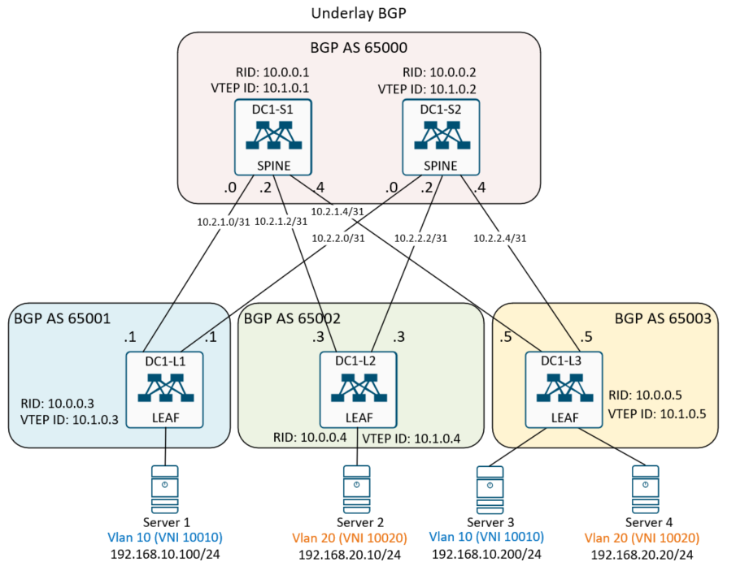
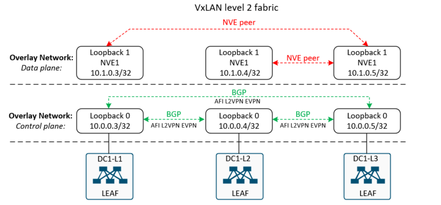
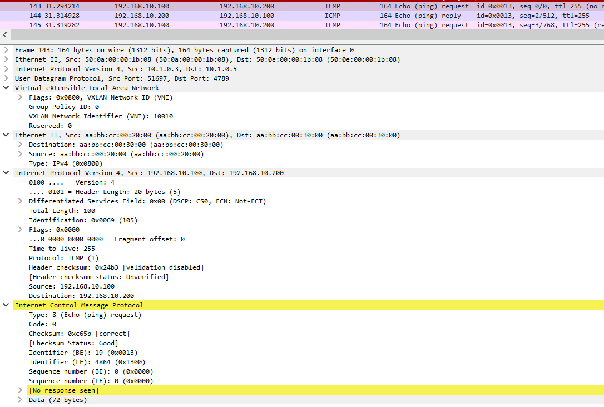

## Домашнее задание
<b>VxLAN EVPN L2 </b>

Цель:
- Настроить BGP peering между VTEP в l2vpn evpn;
- Проверить связность между клиентами.

<br>

## Схема соединений, Underlay BGP, размещение клиентов в ЦОДе.



<br>

## Схема взаимодействия в VXLAN фабрике.




## Выполнение домашней работы в EVE-NG

В качестве underlay сети используется схема из LAB4. Underlay eBGP.<br>
Настройка SPINE не менялась.<br>
Ниже приведены команды только для настройки Vlan и VxLan.

### Настройка коммутаторов

<details>
<summary>Конфигурация коммутатора <b>DC1-L1</b>: </summary>
```
nv overlay evpn
feature bgp
feature interface-vlan
feature vn-segment-vlan-based
feature nv overlay

vlan 10
  name Vlan10
  vn-segment 10010

interface nve1
  no shutdown
  source-interface loopback1
  member vni 10010
    ingress-replication protocol static
      peer-ip 10.1.0.5
      
interface Ethernet1/1
  description Server1
  switchport access vlan 10
```
</details>

<details>
<summary>Конфигурация коммутатора <b>DC1-L2</b>: </summary>
```
hostname DC1-L2
nv overlay evpn
feature bgp
feature interface-vlan
feature vn-segment-vlan-based
feature nv overlay

vlan 20
  name Vlan20
  vn-segment 10020

interface nve1
  no shutdown
  source-interface loopback1
  member vni 10020
    ingress-replication protocol static
      peer-ip 10.1.0.5

interface Ethernet1/1
  description Server02
  switchport access vlan 20
```
</details>

<details>
<summary>Конфигурация коммутатора <b>DC1-L3</b>: </summary>
```
hostname DC1-L3

nv overlay evpn
feature bgp
feature interface-vlan
feature vn-segment-vlan-based
feature nv overlay

vlan 10
  name Vlan10
  vn-segment 10010
vlan 20
  name Vlan20
  vn-segment 10020

interface nve1
  no shutdown
  source-interface loopback1
  member vni 10010
    ingress-replication protocol static
      peer-ip 10.1.0.3
  member vni 10020
    ingress-replication protocol static
      peer-ip 10.1.0.4

interface Ethernet1/1
  description Server3
  switchport access vlan 10

interface Ethernet1/2
  description Server4
  switchport access vlan 20
```
</details>

### Проверка связности по L2 

Проверка протокола VxLAN на коммутаторе <b>DC1-L1</b>:
```
DC1-L1(config)# sh nve peer
Interface Peer-IP                                 State LearnType Uptime   Router-Mac
--------- --------------------------------------  ----- --------- -------- -----------------
nve1      10.1.0.5                                Up    DP        14:42:07 n/a

DC1-L1(config)# sh nve vni
Codes: CP - Control Plane        DP - Data Plane
       UC - Unconfigured         SA - Suppress ARP
       SU - Suppress Unknown Unicast
       Xconn - Crossconnect
       MS-IR - Multisite Ingress Replication

Interface VNI      Multicast-group   State Mode Type [BD/VRF]      Flags
--------- -------- ----------------- ----- ---- ------------------ -----
nve1      10010    UnicastStatic     Up    DP   L2 [10]

DC1-L1# sh mac addr
Legend:
        * - primary entry, G - Gateway MAC, (R) - Routed MAC, O - Overlay MAC
        age - seconds since last seen,+ - primary entry using vPC Peer-Link,
        (T) - True, (F) - False, C - ControlPlane MAC, ~ - vsan
   VLAN     MAC Address      Type      age     Secure NTFY Ports
---------+-----------------+--------+---------+------+----+------------------
*   10     aabb.cc00.2000   dynamic  0         F      F    Eth1/1
*   10     aabb.cc00.3000   dynamic  0         F      F    nve1(10.1.0.5)
*   10     500c.0000.1b08   static   -         F      F    Vlan10
G    -     500c.0000.1b08   static   -         F      F    sup-eth1(R)
G   10     500c.0000.1b08   static   -         F      F    sup-eth1(R)

```
Проверка протокола VxLAN на коммутаторе <b> DC1-L2</b>:
```
DC1-L2(config)# sh nve peer
Interface Peer-IP                                 State LearnType Uptime   Router-Mac
--------- --------------------------------------  ----- --------- -------- -----------------
nve1      10.1.0.5                                Up    DP        01:02:44 n/a

DC1-L2(config)# sh nve vni
Codes: CP - Control Plane        DP - Data Plane
       UC - Unconfigured         SA - Suppress ARP
       SU - Suppress Unknown Unicast
       Xconn - Crossconnect
       MS-IR - Multisite Ingress Replication

Interface VNI      Multicast-group   State Mode Type [BD/VRF]      Flags
--------- -------- ----------------- ----- ---- ------------------ -----
nve1      10020    UnicastStatic     Up    DP   L2 [20]

DC1-L2(config)# sh mac addr
Legend:
        * - primary entry, G - Gateway MAC, (R) - Routed MAC, O - Overlay MAC
        age - seconds since last seen,+ - primary entry using vPC Peer-Link,
        (T) - True, (F) - False, C - ControlPlane MAC, ~ - vsan
   VLAN     MAC Address      Type      age     Secure NTFY Ports
---------+-----------------+--------+---------+------+----+------------------
*   20     500e.0000.1b08   dynamic  0         F      F    nve1(10.1.0.5)
*   20     aabb.cc00.4000   dynamic  0         F      F    nve1(10.1.0.5)
*   20     aabb.cc00.5000   dynamic  0         F      F    Eth1/1
*   20     500d.0000.1b08   static   -         F      F    Vlan20
G    -     500d.0000.1b08   static   -         F      F    sup-eth1(R)
G   20     500d.0000.1b08   static   -         F      F    sup-eth1(R)
```

Проверка протокола VxLAN на коммутаторе <b>DC1-L3</b>:
```
DC1-L3(config)# sh nve peer
Interface Peer-IP                                 State LearnType Uptime   Router-Mac
--------- --------------------------------------  ----- --------- -------- -----------------
nve1      10.1.0.3                                Up    DP        01:04:44 n/a
nve1      10.1.0.4                                Up    DP        01:04:44 n/a

DC1-L3(config)# sh nve vni
Codes: CP - Control Plane        DP - Data Plane
       UC - Unconfigured         SA - Suppress ARP
       SU - Suppress Unknown Unicast
       Xconn - Crossconnect
       MS-IR - Multisite Ingress Replication

Interface VNI      Multicast-group   State Mode Type [BD/VRF]      Flags
--------- -------- ----------------- ----- ---- ------------------ -----
nve1      10010    UnicastStatic     Up    DP   L2 [10]
nve1      10020    UnicastStatic     Up    DP   L2 [20]

DC1-L3(config)# sh mac addr
Legend:
        * - primary entry, G - Gateway MAC, (R) - Routed MAC, O - Overlay MAC
        age - seconds since last seen,+ - primary entry using vPC Peer-Link,
        (T) - True, (F) - False, C - ControlPlane MAC, ~ - vsan
   VLAN     MAC Address      Type      age     Secure NTFY Ports
---------+-----------------+--------+---------+------+----+------------------
*   10     500c.0000.1b08   dynamic  0         F      F    nve1(10.1.0.3)
*   10     aabb.cc00.2000   dynamic  0         F      F    nve1(10.1.0.3)
*   10     aabb.cc00.3000   dynamic  0         F      F    Eth1/1
*   10     500e.0000.1b08   static   -         F      F    Vlan10
*   20     500d.0000.1b08   dynamic  0         F      F    nve1(10.1.0.4)
*   20     aabb.cc00.4000   dynamic  0         F      F    Eth1/2
*   20     aabb.cc00.5000   dynamic  0         F      F    nve1(10.1.0.4)
*   20     500e.0000.1b08   static   -         F      F    Vlan20
G    -     500e.0000.1b08   static   -         F      F    sup-eth1(R)
G   10     500e.0000.1b08   static   -         F      F    sup-eth1(R)
G   20     500e.0000.1b08   static   -         F      F    sup-eth1(R)
```

Проверка доступности хостов <b>Server1 < - > Server3</b>:
```
Server1#sh ip int br
Interface              IP-Address      OK? Method Status                Protocol
Ethernet0/0            192.168.10.100  YES manual up                    up

Server1#ping 192.168.10.200
Type escape sequence to abort.
Sending 5, 100-byte ICMP Echos to 192.168.10.200, timeout is 2 seconds:
!!!!!
Success rate is 100 percent (5/5), round-trip min/avg/max = 0/32/75 ms

Server1#sh arp
Protocol  Address          Age (min)  Hardware Addr   Type   Interface
Internet  192.168.10.10          12   500c.0000.1b08  ARPA   Ethernet0/0
Internet  192.168.10.100          -   aabb.cc00.2000  ARPA   Ethernet0/0
Internet  192.168.10.200        113   aabb.cc00.3000  ARPA   Ethernet0/0

Server3#sh ip int br
Interface              IP-Address      OK? Method Status                Protocol
Ethernet0/0            192.168.10.200  YES manual up                    up

Server3#ping 192.168.10.100
Type escape sequence to abort.
Sending 5, 100-byte ICMP Echos to 192.168.10.100, timeout is 2 seconds:
!!!!!
Success rate is 100 percent (5/5), round-trip min/avg/max = 9/19/55 ms

Server3#sh arp
Protocol  Address          Age (min)  Hardware Addr   Type   Interface
Internet  192.168.10.20          96   500e.0000.1b08  ARPA   Ethernet0/0
Internet  192.168.10.100        114   aabb.cc00.2000  ARPA   Ethernet0/0
Internet  192.168.10.200          -   aabb.cc00.3000  ARPA   Ethernet0/0
```

Проверка доступности хостов <b>Server2 < - > Server4</b>:
```
Server2#sh ip int br
Interface              IP-Address      OK? Method Status                Protocol
Ethernet0/0            192.168.20.10   YES manual up                    up

Server2#ping 192.168.20.20
Type escape sequence to abort.
Sending 5, 100-byte ICMP Echos to 192.168.20.20, timeout is 2 seconds:
!!!!!
Success rate is 100 percent (5/5), round-trip min/avg/max = 8/20/42 ms

Server2#sh arp
Protocol  Address          Age (min)  Hardware Addr   Type   Interface
Internet  192.168.20.10           -   aabb.cc00.5000  ARPA   Ethernet0/0
Internet  192.168.20.20          58   aabb.cc00.4000  ARPA   Ethernet0/0

Server4#sh ip int br
Interface              IP-Address      OK? Method Status                Protocol
Ethernet0/0            192.168.20.20   YES NVRAM  up                    up

Server4#ping 192.168.20.10
Type escape sequence to abort.
Sending 5, 100-byte ICMP Echos to 192.168.20.10, timeout is 2 seconds:
!!!!!
Success rate is 100 percent (5/5), round-trip min/avg/max = 9/10/12 ms

Server4#sh arp
Protocol  Address          Age (min)  Hardware Addr   Type   Interface
Internet  192.168.20.10          59   aabb.cc00.5000  ARPA   Ethernet0/0
Internet  192.168.20.20           -   aabb.cc00.4000  ARPA   Ethernet0/0
```

### Пример трассировки пакета 
