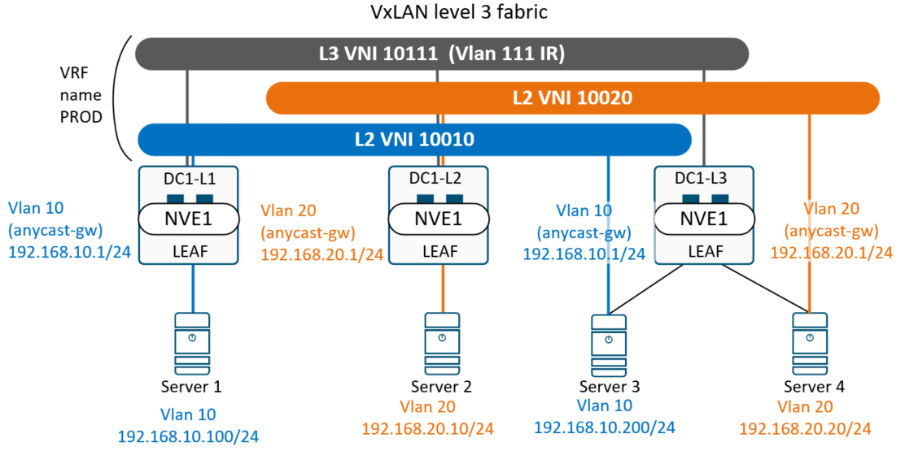

## Домашнее задание
<b>VxLAN EVPN L3 </b>

Цель:
- Настроить клиентов в двух разных VNI на разных LEAF.
- Настроить маршрутизацию между клиентами разных VNI

<br>

## Схема маршрутизации между клиентами разных VNI.



<br>

## Выполнение домашней работы в EVE-NG

В качестве underlay и overlay сети используется схема из <b>LAB5. VxLAN. EVPN L2</b><br>

### Настройка коммутаторов
Указаны команды, использованные только в рамках этой лабы. Остальное без изменений.

<details>
<summary>Конфигурация коммутатора <b>DC1-L1</b>: </summary>

```
fabric forwarding anycast-gateway-mac 1234.1234.1234

vlan 10
  name TEST
  vn-segment 10010
vlan 111
  name IR
  vn-segment 10111

vrf context prod
  vni 10111
  rd 65001:111
  address-family ipv4 unicast
    route-target import 10111:111
    route-target import 10111:111 evpn
    route-target export 10111:111
    route-target export 10111:111 evpn

interface Vlan10
  description TEST
  no shutdown
  vrf member prod
  ip address 192.168.10.1/24
  fabric forwarding mode anycast-gateway

interface Vlan111
  description IR
  no shutdown
  vrf member prod
  ip forward

interface nve1
  no shutdown
  host-reachability protocol bgp
  source-interface loopback1
  member vni 10010
    ingress-replication protocol bgp
  member vni 10111 associate-vrf

interface Ethernet1/1
  description Server1
  switchport access vlan 10

```
</details>

<details>
<summary>Конфигурация коммутатора <b>DC1-L2</b>: </summary>

```
fabric forwarding anycast-gateway-mac 1234.1234.1234

vlan 20
  name PROD
  vn-segment 10020
vlan 111
  name IR
  vn-segment 10111

vrf context prod
  vni 10111
  rd 65002:111
  address-family ipv4 unicast
    route-target import 10111:111
    route-target import 10111:111 evpn
    route-target export 10111:111
    route-target export 10111:111 evpn

interface Vlan20
  description PROD
  no shutdown
  vrf member prod
  ip address 192.168.20.1/24
  fabric forwarding mode anycast-gateway

interface Vlan111
  description IR
  no shutdown
  vrf member prod
  ip forward

interface nve1
  no shutdown
  host-reachability protocol bgp
  source-interface loopback1
  member vni 10020
    ingress-replication protocol bgp
  member vni 10111 associate-vrf

interface Ethernet1/1
  description Server02
  switchport access vlan 20

```
</details>

<details>
<summary>Конфигурация коммутатора <b>DC1-L3</b>: </summary>

```
fabric forwarding anycast-gateway-mac 1234.1234.1234

vlan 10
  name Vlan10
  vn-segment 10010
vlan 20
  name Vlan20
  vn-segment 10020
vlan 111
  name IR
  vn-segment 10111

vrf context prod
  vni 10111
  rd 65003:111
  address-family ipv4 unicast
    route-target import 10111:111
    route-target import 10111:111 evpn
    route-target export 10111:111
    route-target export 10111:111 evpn

interface Vlan10
  description TEST
  no shutdown
  vrf member prod
  ip address 192.168.10.1/24
  fabric forwarding mode anycast-gateway

interface Vlan20
  description PROD
  no shutdown
  vrf member prod
  ip address 192.168.20.1/24
  fabric forwarding mode anycast-gateway

interface Vlan111
  description IR
  no shutdown
  vrf member prod
  ip forward

interface nve1
  no shutdown
  host-reachability protocol bgp
  source-interface loopback1
  member vni 10010
    ingress-replication protocol bgp
  member vni 10020
    ingress-replication protocol bgp
  member vni 10111 associate-vrf

interface Ethernet1/1
  description Server3
  switchport access vlan 10

interface Ethernet1/2
  description Server4
  switchport access vlan 20

```
</details>

### Проверка доступности маршрутов через VNI L3

Проверка протокола VxLAN на коммутаторе <b>DC1-L1</b>:
```
DC1-L1# sh bgp l2 e vni-id 10111
BGP routing table information for VRF default, address family L2VPN EVPN
BGP table version is 80, Local Router ID is 10.0.0.3
Status: s-suppressed, x-deleted, S-stale, d-dampened, h-history, *-valid, >-best
Path type: i-internal, e-external, c-confed, l-local, a-aggregate, r-redist, I-i
njected
Origin codes: i - IGP, e - EGP, ? - incomplete, | - multipath, & - backup, 2 - b
est2

   Network            Next Hop            Metric     LocPrf     Weight Path
Route Distinguisher: 65001:111    (L3VNI 10111)
*>e[2]:[0]:[0]:[48]:[aabb.cc00.3000]:[32]:[192.168.10.200]/272
                      10.1.0.5                                       0 65000 65003 i
*>e[2]:[0]:[0]:[48]:[aabb.cc00.4000]:[32]:[192.168.20.20]/272
                      10.1.0.5                                       0 65000 65003 i
*>e[2]:[0]:[0]:[48]:[aabb.cc00.5000]:[32]:[192.168.20.10]/272
                      10.1.0.4                                       0 65000 65002 i

```
Проверка протокола VxLAN на коммутаторе <b> DC1-L2</b>:
```
DC1-L2# sh bgp l2 e vni-id 10111
BGP routing table information for VRF default, address family L2VPN EVPN
BGP table version is 81, Local Router ID is 10.0.0.4
Status: s-suppressed, x-deleted, S-stale, d-dampened, h-history, *-valid, >-best
Path type: i-internal, e-external, c-confed, l-local, a-aggregate, r-redist, I-i
njected
Origin codes: i - IGP, e - EGP, ? - incomplete, | - multipath, & - backup, 2 - b
est2

   Network            Next Hop            Metric     LocPrf     Weight Path
Route Distinguisher: 65002:111    (L3VNI 10111)
*>e[2]:[0]:[0]:[48]:[aabb.cc00.2000]:[32]:[192.168.10.100]/272
                      10.1.0.3                                       0 65000 65001 i
*>e[2]:[0]:[0]:[48]:[aabb.cc00.3000]:[32]:[192.168.10.200]/272
                      10.1.0.5                                       0 65000 65003 i
*>e[2]:[0]:[0]:[48]:[aabb.cc00.4000]:[32]:[192.168.20.20]/272
                      10.1.0.5                                       0 65000 65003 i

```

Проверка протокола VxLAN на коммутаторе <b>DC1-L3</b>:
```
DC1-L3(config)# sh bgp l2 e vni-id 10111
BGP routing table information for VRF default, address family L2VPN EVPN
BGP table version is 95, Local Router ID is 10.0.0.5
Status: s-suppressed, x-deleted, S-stale, d-dampened, h-history, *-valid, >-best
Path type: i-internal, e-external, c-confed, l-local, a-aggregate, r-redist, I-injec   ted
Origin codes: i - IGP, e - EGP, ? - incomplete, | - multipath, & - backup, 2 - best2

   Network            Next Hop            Metric     LocPrf     Weight Path
Route Distinguisher: 65003:111    (L3VNI 10111)
*>e[2]:[0]:[0]:[48]:[aabb.cc00.2000]:[32]:[192.168.10.100]/272
                      10.1.0.3                                       0 65000 65001 i
*>e[2]:[0]:[0]:[48]:[aabb.cc00.5000]:[32]:[192.168.20.10]/272
                      10.1.0.4                                       0 65000 65002 i

```

Проверка доступности хостов  <b>Server1 - > Server2,Server4</b>:
```
Server1#sh ip ro
Codes: L - local, C - connected, S - static, R - RIP, M - mobile, B - BGP
   Gateway of last resort is 192.168.10.1 to network 0.0.0.0

S*    0.0.0.0/0 [1/0] via 192.168.10.1
      192.168.10.0/24 is variably subnetted, 2 subnets, 2 masks
C        192.168.10.0/24 is directly connected, Ethernet0/0
L        192.168.10.100/32 is directly connected, Ethernet0/0
Server1#ping 192.168.20.10
Type escape sequence to abort.
Sending 5, 100-byte ICMP Echos to 192.168.20.10, timeout is 2 seconds:
!!!!!
Success rate is 100 percent (5/5), round-trip min/avg/max = 9/19/47 ms
Server1#ping 192.168.20.20
Type escape sequence to abort.
Sending 5, 100-byte ICMP Echos to 192.168.20.20, timeout is 2 seconds:
!!!!!
Success rate is 100 percent (5/5), round-trip min/avg/max = 11/14/23 ms

```

Проверка доступности хостов <b>Server2  - > Server1,Server2,Server3</b>:
```
Server2#sh ip ro
Codes: L - local, C - connected, S - static, R - RIP, M - mobile, B - BGP
 Gateway of last resort is 192.168.20.1 to network 0.0.0.0

S*    0.0.0.0/0 [1/0] via 192.168.20.1
      192.168.20.0/24 is variably subnetted, 2 subnets, 2 masks
C        192.168.20.0/24 is directly connected, Ethernet0/0
L        192.168.20.10/32 is directly connected, Ethernet0/0
Server2#ping 192.168.10.100
Type escape sequence to abort.
Sending 5, 100-byte ICMP Echos to 192.168.10.100, timeout is 2 seconds:
!!!!!
Success rate is 100 percent (5/5), round-trip min/avg/max = 8/17/45 ms
Server2#ping 192.168.10.200
Type escape sequence to abort.
Sending 5, 100-byte ICMP Echos to 192.168.10.200, timeout is 2 seconds:
!!!!!
Success rate is 100 percent (5/5), round-trip min/avg/max = 9/13/24 ms
Server2#ping 192.168.20.20
Type escape sequence to abort.
Sending 5, 100-byte ICMP Echos to 192.168.20.20, timeout is 2 seconds:
!!!!!
Success rate is 100 percent (5/5), round-trip min/avg/max = 7/15/41 ms
Server2#

```
