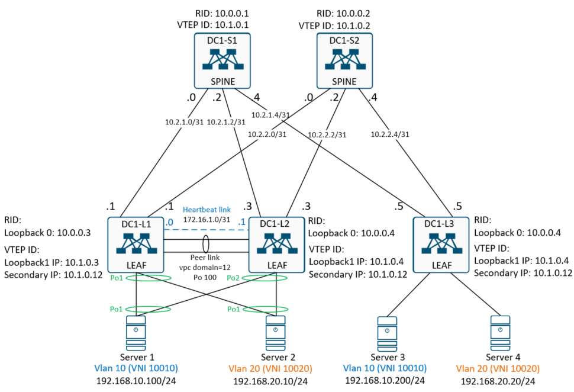

## Домашнее задание
<b>VxLAN VPC </b>

Цель:
- Настроить vPC пару свичей DC1-L1 и DC1-L2;
- подключить Server1 и Server2 аггрегированными каналами к vPC паре.
- Проверить связность между клиентами vPC пары и отдельным LEAF DC1-L3 в одном VLANе.

<br>


## Схема физической коммутации стенда.


## Логическая схема настройки vPC пары.



<br>

## Выполнение домашней работы в EVE-NG

В качестве overlay сети используется конфигурация <b>LAB5. VXLAN L2.</b><br>

### Настройка коммутаторов

Ниже приведены команды, используемые только в рамках этой лабы. Остальные настройки остаются без изменений.

<details>
<summary>Конфигурация коммутатора <b>DC1-L1</b>: </summary>

```
feature lacp
feature vpc

vlan 10
  name TEST
  vn-segment 10010
vlan 20
  name PROD
  vn-segment 10020

vpc domain 12
  peer-switch
  role priority 10
  peer-keepalive destination 172.16.1.1 source 172.16.1.0

interface port-channel1
  description to Server 1
  switchport access vlan 10
  spanning-tree port type edge
  vpc 1

interface port-channel2
  description to Server2
  switchport access vlan 20
  spanning-tree port type edge
  vpc 2

interface port-channel100
  description vPC peer link (E1/3, E1/4)
  switchport mode trunk
  spanning-tree port type network
  vpc peer-link

interface nve1
  no shutdown
  host-reachability protocol bgp
  source-interface loopback1
  member vni 10010
    ingress-replication protocol bgp
  member vni 10020
    ingress-replication protocol bgp

interface Ethernet1/1
  description to Server 1
  switchport access vlan 10
  channel-group 1

interface Ethernet1/1
  description Server1
  switchport access vlan 10
  
  interface Ethernet1/2
    description Server2
    switchport access vlan 20
    channel-group 2
  
  interface Ethernet1/3
    description vPC peer link
    switchport mode trunk
    channel-group 100 mode active
  
  interface Ethernet1/4
    description vPC peer link
    switchport mode trunk
    channel-group 100 mode active

interface mgmt0
  vrf member management
  ip address 172.16.1.0/31
  
  interface loopback1
    description VTEP
    ip address 10.1.0.3/32
    ip address 10.1.0.12/32 secondary

evpn
  vni 10010 l2
    rd 65001:10
    route-target import 10:10010
    route-target export 10:10010
  vni 10020 l2
    rd 65001:20
    route-target import 20:10020
    route-target export 20:10020
  
```
</details>

<details>
<summary>Конфигурация коммутатора <b>DC1-L2</b>: </summary>

```
hostname DC1-L2

feature lacp
feature vpc

vlan 10
  name TEST
  vn-segment 10010
vlan 20
  name PROD
  vn-segment 10020

vpc domain 12
  peer-switch
  role priority 20
  peer-keepalive destination 172.16.1.0 source 172.16.1.1

interface port-channel1
  description to Server 1
  switchport access vlan 10
  spanning-tree port type edge
  vpc 1

interface port-channel2
  description to Server2
  switchport access vlan 20
  spanning-tree port type edge
  vpc 2

interface port-channel100
  description vPC peer link (E1/3, E1/4)
  switchport mode trunk
  spanning-tree port type network
  vpc peer-link

interface nve1
  no shutdown
  host-reachability protocol bgp
  source-interface loopback1
  member vni 10010
    ingress-replication protocol bgp
  member vni 10020
    ingress-replication protocol bgp

interface Ethernet1/1
  description to Server 1
  switchport access vlan 10
  channel-group 1

interface Ethernet1/1
  description Server1
  switchport access vlan 10
  
  interface Ethernet1/2
    description Server2
    switchport access vlan 20
    channel-group 2
  
  interface Ethernet1/3
    description vPC peer link
    switchport mode trunk
    channel-group 100 mode active
  
  interface Ethernet1/4
    description vPC peer link
    switchport mode trunk
    channel-group 100 mode active

interface mgmt0
  vrf member management
  ip address 172.16.1.1/31
  
  interface loopback1
    description VTEP
    ip address 10.1.0.4/32
    ip address 10.1.0.12/32 secondary

evpn
  vni 10010 l2
    rd 65001:10
    route-target import 10:10010
    route-target export 10:10010
  vni 10020 l2
    rd 65001:20
    route-target import 20:10020
    route-target export 20:10020

```
</details>

<details>
<summary>Конфигурация сервера <b>Server1</b> </summary>

```
hostname Server1

interface Port-channel1
 description to LEAF1,2
 switchport access vlan 10
 switchport mode access

interface Ethernet0/0
 description to LEAF-1,2
 switchport access vlan 10
 switchport mode access
 channel-group 1 mode on

interface Ethernet0/1
 description to LEAF-1,2
 switchport access vlan 10
 switchport mode access
 channel-group 1 mode on

interface Vlan10
 ip address 192.168.10.100 255.255.255.0
!
```
</details>

<details>
<summary>Конфигурация сервера <b>Server2</b>: </summary>

```
hostname Server2

interface Port-channel1
 description to LEAF1,2
 switchport access vlan 20
 switchport mode access

interface Ethernet0/0
 description to LEAF-1,2
 switchport access vlan 20
 switchport mode access
 channel-group 1 mode on

interface Ethernet0/1
 description to LEAF-1,2
 switchport access vlan 20
 switchport mode access
 channel-group 1 mode on

interface Vlan20
 ip address 192.168.20.10 255.255.255.0

```
</details>

### Проверка настройки vPC. Смотрим на обоих коммутаторах состояние vPC домена, агрегацию каналов (Po) и происхождение MAC адресов.

Проверка vPC на коммутаторе <b>DC1-L1</b>:
```
DC1-L1# sh vpc br
Legend:
                (*) - local vPC is down, forwarding via vPC peer-link

vPC domain id                     : 12
Peer status                       : peer adjacency formed ok
vPC keep-alive status             : peer is alive
Configuration consistency status  : success
Per-vlan consistency status       : success
Type-2 consistency status         : success
vPC role                          : primary
Number of vPCs configured         : 2
Peer Gateway                      : Disabled
Dual-active excluded VLANs        : -
Graceful Consistency Check        : Enabled
Auto-recovery status              : Disabled
Delay-restore status              : Timer is off.(timeout = 30s)
Delay-restore SVI status          : Timer is off.(timeout = 10s)
Operational Layer3 Peer-router    : Disabled
Virtual-peerlink mode             : Disabled

vPC Peer-link status
---------------------------------------------------------------------
id    Port   Status Active vlans
--    ----   ------ -------------------------------------------------
1     Po100  up     1,10,20

vPC status
----------------------------------------------------------------------------
Id    Port          Status Consistency Reason                Active vlans
--    ------------  ------ ----------- ------                ---------------
1     Po1           up     success     success               10

2     Po2           up     success     success               20

DC1-L1# sh port-channel sum
Flags:  D - Down        P - Up in port-channel (members)
        I - Individual  H - Hot-standby (LACP only)
        s - Suspended   r - Module-removed
        b - BFD Session Wait
        S - Switched    R - Routed
        U - Up (port-channel)
        p - Up in delay-lacp mode (member)
        M - Not in use. Min-links not met
--------------------------------------------------------------------------------
Group Port-       Type     Protocol  Member Ports
      Channel
--------------------------------------------------------------------------------
1     Po1(SU)     Eth      NONE      Eth1/1(P)
2     Po2(SU)     Eth      NONE      Eth1/2(P)
100   Po100(SU)   Eth      LACP      Eth1/3(P)    Eth1/4(P)

DC1-L1# sh mac addr
Legend:
        * - primary entry, G - Gateway MAC, (R) - Routed MAC, O - Overlay MAC
        age - seconds since last seen,+ - primary entry using vPC Peer-Link,
        (T) - True, (F) - False, C - ControlPlane MAC, ~ - vsan
   VLAN     MAC Address      Type      age     Secure NTFY Ports
---------+-----------------+--------+---------+------+----+------------------
C   10     aabb.cc00.3000   dynamic  0         F      F    nve1(10.1.0.5)
*   10     aabb.cc80.2000   dynamic  0         F      F    Po1
C   20     aabb.cc00.4000   dynamic  0         F      F    nve1(10.1.0.5)
*   20     aabb.cc80.5000   dynamic  0         F      F    Po2
G    -     1234.1234.1234   static   -         F      F    sup-eth1(R)
G    -     500c.0000.1b08   static   -         F      F    sup-eth1(R)


```

Проверка vPC на коммутаторе <b>DC1-L2 </b>:
```

DC1-L2# sh vpc br
Legend:
                (*) - local vPC is down, forwarding via vPC peer-link

vPC domain id                     : 12
Peer status                       : peer adjacency formed ok
vPC keep-alive status             : peer is alive
Configuration consistency status  : success
Per-vlan consistency status       : success
Type-2 consistency status         : success
vPC role                          : secondary
Number of vPCs configured         : 2
Peer Gateway                      : Disabled
Dual-active excluded VLANs        : -
Graceful Consistency Check        : Enabled
Auto-recovery status              : Disabled
Delay-restore status              : Timer is off.(timeout = 30s)
Delay-restore SVI status          : Timer is off.(timeout = 10s)
Operational Layer3 Peer-router    : Disabled
Virtual-peerlink mode             : Disabled

vPC Peer-link status
---------------------------------------------------------------------
id    Port   Status Active vlans
--    ----   ------ -------------------------------------------------
1     Po100  up     1,10,20

vPC status
----------------------------------------------------------------------------
Id    Port          Status Consistency Reason                Active vlans
--    ------------  ------ ----------- ------                ---------------
1     Po1           up     success     success               10

2     Po2           up     success     success               20

DC1-L2# sh port-channel sum
Flags:  D - Down        P - Up in port-channel (members)
        I - Individual  H - Hot-standby (LACP only)
        s - Suspended   r - Module-removed
        b - BFD Session Wait
        S - Switched    R - Routed
        U - Up (port-channel)
        p - Up in delay-lacp mode (member)
        M - Not in use. Min-links not met
--------------------------------------------------------------------------------
Group Port-       Type     Protocol  Member Ports
      Channel
--------------------------------------------------------------------------------
1     Po1(SU)     Eth      NONE      Eth1/1(P)
2     Po2(SU)     Eth      NONE      Eth1/2(P)
100   Po100(SU)   Eth      LACP      Eth1/3(P)    Eth1/4(P)

DC1-L2# sh mac addr
Legend:
        * - primary entry, G - Gateway MAC, (R) - Routed MAC, O - Overlay MAC
        age - seconds since last seen,+ - primary entry using vPC Peer-Link,
        (T) - True, (F) - False, C - ControlPlane MAC, ~ - vsan
   VLAN     MAC Address      Type      age     Secure NTFY Ports
---------+-----------------+--------+---------+------+----+------------------
C   10     aabb.cc00.3000   dynamic  0         F      F    nve1(10.1.0.5)
+   10     aabb.cc80.2000   dynamic  0         F      F    Po1
C   20     aabb.cc00.4000   dynamic  0         F      F    nve1(10.1.0.5)
+   20     aabb.cc80.5000   dynamic  0         F      F    Po2
G    -     1234.1234.1234   static   -         F      F    sup-eth1(R)
G    -     500d.0000.1b08   static   -         F      F    sup-eth1(R)

```

### Проверка информации от nve пиров по VxLAN на LEAF DC1-L3

Проверка информации от nve пиров на коммутаторе <b>DC1-L3</b>:
```
DC1-L3# sh bgp l2 e vni-id 10010
BGP routing table information for VRF default, address family L2VPN EVPN
BGP table version is 101, Local Router ID is 10.0.0.5
Status: s-suppressed, x-deleted, S-stale, d-dampened, h-history, *-valid, >-best
Path type: i-internal, e-external, c-confed, l-local, a-aggregate, r-redist, I-injected
Origin codes: i - IGP, e - EGP, ? - incomplete, | - multipath, & - backup, 2 - best2

   Network            Next Hop            Metric     LocPrf     Weight Path
Route Distinguisher: 65003:10    (L2VNI 10010)
*>l[2]:[0]:[0]:[48]:[aabb.cc00.3000]:[0]:[0.0.0.0]/216
                      10.1.0.5                          100      32768 i
* e[2]:[0]:[0]:[48]:[aabb.cc80.2000]:[0]:[0.0.0.0]/216
                      10.1.0.12                                      0 65000 65002 i
*>e                   10.1.0.12                                      0 65000 65001 i
*>l[2]:[0]:[0]:[48]:[aabb.cc00.3000]:[32]:[192.168.10.200]/248
                      10.1.0.5                          100      32768 i
*>l[3]:[0]:[32]:[10.1.0.5]/88
                      10.1.0.5                          100      32768 i
* e[3]:[0]:[32]:[10.1.0.12]/88
                      10.1.0.12                                      0 65000 65002 i
*>e                   10.1.0.12                                      0 65000 65001 i

DC1-L3# sh bgp l2 e vni-id 10020
BGP routing table information for VRF default, address family L2VPN EVPN
BGP table version is 101, Local Router ID is 10.0.0.5
Status: s-suppressed, x-deleted, S-stale, d-dampened, h-history, *-valid, >-best
Path type: i-internal, e-external, c-confed, l-local, a-aggregate, r-redist, I-injected
Origin codes: i - IGP, e - EGP, ? - incomplete, | - multipath, & - backup, 2 - best2

   Network            Next Hop            Metric     LocPrf     Weight Path
Route Distinguisher: 65003:20    (L2VNI 10020)
*>l[2]:[0]:[0]:[48]:[aabb.cc00.4000]:[0]:[0.0.0.0]/216
                      10.1.0.5                          100      32768 i
* e[2]:[0]:[0]:[48]:[aabb.cc80.5000]:[0]:[0.0.0.0]/216
                      10.1.0.12                                      0 65000 65002 i
*>e                   10.1.0.12                                      0 65000 65001 i
*>l[2]:[0]:[0]:[48]:[aabb.cc00.4000]:[32]:[192.168.20.20]/248
                      10.1.0.5                          100      32768 i
*>l[3]:[0]:[32]:[10.1.0.5]/88
                      10.1.0.5                          100      32768 i
* e[3]:[0]:[32]:[10.1.0.12]/88
                      10.1.0.12                                      0 65000 65001 i
*>e                   10.1.0.12                                      0 65000 65002 i

DC1-L3# sh mac addr
Legend:
        * - primary entry, G - Gateway MAC, (R) - Routed MAC, O - Overlay MAC
        age - seconds since last seen,+ - primary entry using vPC Peer-Link,
        (T) - True, (F) - False, C - ControlPlane MAC, ~ - vsan
   VLAN     MAC Address      Type      age     Secure NTFY Ports
---------+-----------------+--------+---------+------+----+------------------
*   10     aabb.cc00.3000   dynamic  0         F      F    Eth1/1
C   10     aabb.cc80.2000   dynamic  0         F      F    nve1(10.1.0.12)
*   20     aabb.cc00.4000   dynamic  0         F      F    Eth1/2
C   20     aabb.cc80.5000   dynamic  0         F      F    nve1(10.1.0.12)
G    -     1234.1234.1234   static   -         F      F    sup-eth1(R)
G    -     500e.0000.1b08   static   -         F      F    sup-eth1(R)
G   10     500e.0000.1b08   static   -         F      F    sup-eth1(R)
G   20     500e.0000.1b08   static   -         F      F    sup-eth1(R)

```

Проверка доступности хостов <b>Server1 < - > Server3</b>:
```
Server1#sh ip  int br
Interface              IP-Address      OK? Method Status                Protocol
Ethernet0/0            unassigned      YES unset  up                    up
Ethernet0/1            unassigned      YES unset  up                    up
Ethernet0/2            unassigned      YES unset  up                    up
Ethernet0/3            unassigned      YES unset  up                    up
Port-channel1          unassigned      YES unset  up                    up
Vlan10                 192.168.10.100  YES manual up                    up
Server1#ping 192.168.10.200
Type escape sequence to abort.
Sending 5, 100-byte ICMP Echos to 192.168.10.200, timeout is 2 seconds:
!!!!!
Success rate is 100 percent (5/5), round-trip min/avg/max = 9/18/53 ms
Server1#

Server3#sh ip int br
Interface              IP-Address      OK? Method Status                Protocol
Ethernet0/0            192.168.10.200  YES manual up                    up
Ethernet0/1            unassigned      YES unset  up                    up
Ethernet0/2            unassigned      YES unset  up                    up
Ethernet0/3            unassigned      YES unset  up                    up
Server3#
Server3#ping 192.168.10.100
Type escape sequence to abort.
Sending 5, 100-byte ICMP Echos to 192.168.10.100, timeout is 2 seconds:
!!!!!
Success rate is 100 percent (5/5), round-trip min/avg/max = 6/16/47 ms

```

Проверка доступности хостов <b>Server2 < - > Server4</b>:
```
Server2#sh ip int br
Interface              IP-Address      OK? Method Status                Protocol
Ethernet0/0            unassigned      YES unset  up                    up
Ethernet0/1            unassigned      YES unset  up                    up
Ethernet0/2            unassigned      YES unset  up                    up
Ethernet0/3            unassigned      YES unset  up                    up
Port-channel1          unassigned      YES unset  up                    up
Vlan20                 192.168.20.10   YES manual up                    up
Server2#
Server2#ping 192.168.20.20
Type escape sequence to abort.
Sending 5, 100-byte ICMP Echos to 192.168.20.20, timeout is 2 seconds:
!!!!!
Success rate is 100 percent (5/5), round-trip min/avg/max = 7/23/58 ms

Server4#sh ip int br
Interface              IP-Address      OK? Method Status                Protocol
Ethernet0/0            192.168.20.20   YES manual up                    up
Ethernet0/1            unassigned      YES unset  up                    up
Ethernet0/2            unassigned      YES unset  up                    up
Ethernet0/3            unassigned      YES unset  up                    up
Server4#ping 192.168.20.10
Type escape sequence to abort.
Sending 5, 100-byte ICMP Echos to 192.168.20.10, timeout is 2 seconds:
!!!!!
Success rate is 100 percent (5/5), round-trip min/avg/max = 10/14/27 ms
Server4#

```
