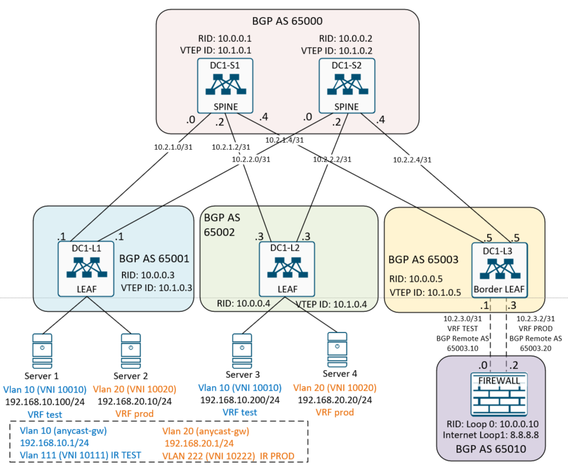

## Домашнее задание
<b>VxLAN. Оптимзация.</b>

Цель:
- Сконфигурировать 2 vlan в отдельных VRF TEST и PROD;
- Сконфигурировать Border LEAF;
- Сконфигурировать Firewall с функциями маршрутизации и Loopback1 для имитации Internet;
- Проверить доступ для серверов в Интернет и досткпность между серверами в разых VRF через Firewall.


<br>


## Схема физической коммутации стенда.


## Логическая схема настройки стенда.



<br>

## Выполнение домашней работы в EVE-NG

В качестве overlay сети используется конфигурация <b>LAB6. VXLAN L3.</b><br>

### Настройка коммутаторов

Ниже приведены команды, используемые только в рамках этой лабы. Остальные настройки остаются без изменений.

<details>
<summary>Конфигурация коммутатора <b>DC1-L1</b>: </summary>

```
hostname DC1-L1

vlan 10
  name TEST
  vn-segment 10010
vlan 20
  name PROD
  vn-segment 10020
vlan 111
  name IR_TEST
  vn-segment 10111
vlan 222
  name IR_PROD
  vn-segment 10222

vrf context prod
  vni 10222
  rd 65001:222
  address-family ipv4 unicast
    route-target import 10222:222
    route-target import 10222:222 evpn
    route-target export 10222:222
    route-target export 10222:222 evpn
vrf context test
  vni 10111
  rd 65001:111
  address-family ipv4 unicast
    route-target import 10111:111
    route-target import 10111:111 evpn
    route-target export 10111:111
    route-target export 10111:111 evpn

interface Vlan10
  description TEST
  no shutdown
  vrf member test
  ip address 192.168.10.1/24
  fabric forwarding mode anycast-gateway

interface Vlan20
  description PROD
  no shutdown
  vrf member prod
  ip address 192.168.20.1/24
  fabric forwarding mode anycast-gateway

interface Vlan111
  description IR_TEST
  no shutdown
  vrf member test
  ip forward

interface Vlan222
  description IR_PROD
  no shutdown
  vrf member prod
  ip forward

interface nve1
  no shutdown
  host-reachability protocol bgp
  source-interface loopback1
  member vni 10010
    ingress-replication protocol bgp
  member vni 10020
    ingress-replication protocol bgp
  member vni 10111 associate-vrf
  member vni 10222 associate-vrf

interface Ethernet1/1
  description Server1
  switchport access vlan 10

interface Ethernet1/2
  description Server2
  switchport access vlan 20

evpn
  vni 10010 l2
    rd 65001:10
    route-target import 10:10010
    route-target export 10:10010
  vni 10020 l2
    rd 65001:20
    route-target import 20:10020
    route-target export 20:10020
  
```
</details>

<details>
<summary>Конфигурация коммутатора <b>DC1-L2</b>: </summary>

```
hostname DC1-L2

vlan 10
  name TEST
  vn-segment 10010
vlan 20
  name PROD
  vn-segment 10020
vlan 111
  name IR_TEST
  vn-segment 10111
vlan 222
  name IR_PROD
  vn-segment 10222

route-map REDISTR-CONNECTED permit 10
  match interface loopback0
route-map REDISTR-CONNECTED permit 20
  match interface loopback1
vrf context management
vrf context prod
  vni 10222
  rd 65002:222
  address-family ipv4 unicast
    route-target import 10222:222
    route-target import 10222:222 evpn
    route-target export 10222:222
    route-target export 10222:222 evpn
vrf context test
  vni 10111
  rd 65002:111
  address-family ipv4 unicast
    route-target import 10111:111
    route-target import 10111:111 evpn
    route-target export 10111:111
    route-target export 10111:111 evpn

interface Vlan10
  description TEST
  no shutdown
  vrf member test
  ip address 192.168.10.1/24
  fabric forwarding mode anycast-gateway

interface Vlan20
  description PROD
  no shutdown
  vrf member prod
  ip address 192.168.20.1/24
  fabric forwarding mode anycast-gateway

interface Vlan111
  description IR_TEST
  no shutdown
  vrf member test
  ip forward

interface Vlan222
  description IR_PROD
  no shutdown
  vrf member prod
  ip forward

interface nve1
  no shutdown
  host-reachability protocol bgp
  source-interface loopback1
  member vni 10010
    ingress-replication protocol bgp
  member vni 10020
    ingress-replication protocol bgp
  member vni 10111 associate-vrf
  member vni 10222 associate-vrf

interface Ethernet1/1
  description Server1
  switchport access vlan 10

interface Ethernet1/2
  description Server2
  switchport access vlan 20

evpn
  vni 10010 l2
    rd 65001:10
    route-target import 10:10010
    route-target export 10:10010
  vni 10020 l2
    rd 65001:20
    route-target import 20:10020
    route-target export 20:10020

```
</details>

<details>
<summary>Конфигурация коммутатора border LEAF <b>DC1-L3</b>:</summary>

```
hostname Server1

vlan 111
  name IR_TEST
  vn-segment 10111
vlan 222
  name IR_PROD
  vn-segment 10222

vrf context prod
  vni 10222
  rd 65003:222
  address-family ipv4 unicast
    route-target import 10222:222
    route-target import 10222:222 evpn
    route-target export 10222:222
    route-target export 10222:222 evpn
vrf context test
  vni 10111
  rd 65003:111
  address-family ipv4 unicast
    route-target import 10111:111
    route-target import 10111:111 evpn
    route-target export 10111:111
    route-target export 10111:111 evpn

interface Vlan111
  description IR_TEST
  no shutdown
  vrf member test
  ip forward

interface Vlan222
  description IR_PROD
  no shutdown
  vrf member prod
  ip forward

interface nve1
  no shutdown
  host-reachability protocol bgp
  source-interface loopback1
  member vni 10111 associate-vrf
  member vni 10222 associate-vrf

interface Ethernet1/1
  description FireWall
  no switchport
  no shutdown

interface Ethernet1/1.10
  description TEST
  encapsulation dot1q 10
  vrf member test
  ip address 10.2.3.1/31
  no shutdown

interface Ethernet1/1.20
  description PROD
  encapsulation dot1q 20
  vrf member prod
  ip address 10.2.3.3/31
  no shutdown

router bgp 65003
  router-id 10.0.0.5

  vrf prod
    address-family ipv4 unicast
      aggregate-address 192.168.20.0/24 summary-only
    neighbor 10.2.3.2
      remote-as 65010
      local-as 4260036628 no-prepend replace-as
      address-family ipv4 unicast
  vrf test
    address-family ipv4 unicast
      aggregate-address 192.168.10.0/24 summary-only
    neighbor 10.2.3.0
      remote-as 65010
      local-as 65003.10 no-prepend replace-as
      address-family ipv4 unicast

```
</details>

<details>
<summary>Конфигурация файроволла <b>Firewall2</b>: </summary>

```
interface Loopback0
 description RID
 ip address 10.0.0.10 255.255.255.255
!
interface Loopback1
 description Internet
 ip address 8.8.8.8 255.255.255.255
!
interface Ethernet0/0
 no switchport
 no ip address
!
interface Ethernet0/0.10
 encapsulation dot1Q 10
 ip address 10.2.3.0 255.255.255.254
!
interface Ethernet0/0.20
 encapsulation dot1Q 20
 ip address 10.2.3.2 255.255.255.254
!
interface Ethernet0/1
!
interface Ethernet0/2
!
interface Ethernet0/3
!
router bgp 65010
 bgp log-neighbor-changes
 neighbor 10.2.3.1 remote-as 4260036618
 neighbor 10.2.3.3 remote-as 4260036628
 !
 address-family ipv4
  network 8.8.8.8 mask 255.255.255.255
  neighbor 10.2.3.1 activate
  neighbor 10.2.3.3 activate
 exit-address-family

```
</details>


### Проверка маршрутизации. 
Смотрим на коммутаторах таблицу маршрутиазации. Анонсы evpn. Источники mac адресов.

Проверка evpn на коммутаторе <b>DC1-L1</b>:
```

DC1-L1(config)# sh ip ro vrf test
IP Route Table for VRF "test"
'*' denotes best ucast next-hop
'**' denotes best mcast next-hop
'[x/y]' denotes [preference/metric]
'%<string>' in via output denotes VRF <string>

8.8.8.8/32, ubest/mbest: 1/0
    *via 10.1.0.5%default, [20/0], 02:07:32, bgp-65001, external, tag 65000, segid: 10111 tunnelid: 0xa010005 encap: VXLAN

192.168.10.0/24, ubest/mbest: 1/0, attached
    *via 192.168.10.1, Vlan10, [0/0], 15:46:03, direct
192.168.10.1/32, ubest/mbest: 1/0, attached
    *via 192.168.10.1, Vlan10, [0/0], 15:46:03, local
192.168.10.100/32, ubest/mbest: 1/0, attached
    *via 192.168.10.100, Vlan10, [190/0], 14:50:17, hmm
192.168.10.200/32, ubest/mbest: 1/0
    *via 10.1.0.4%default, [20/0], 14:46:04, bgp-65001, external, tag 65000, segid: 10111 tunnelid: 0xa010004 encap: VXLAN

192.168.20.0/24, ubest/mbest: 1/0
    *via 10.1.0.5%default, [20/0], 02:03:12, bgp-65001, external, tag 65000, segid: 10111 tunnelid: 0xa010005 encap: VXLAN

DC1-L1(config)# sh ip ro vrf prod
IP Route Table for VRF "prod"
'*' denotes best ucast next-hop
'**' denotes best mcast next-hop
'[x/y]' denotes [preference/metric]
'%<string>' in via output denotes VRF <string>

8.8.8.8/32, ubest/mbest: 1/0
    *via 10.1.0.5%default, [20/0], 02:07:54, bgp-65001, external, tag 65000, segid: 10222 tunnelid: 0xa010005 encap: VXLAN

192.168.10.0/24, ubest/mbest: 1/0
    *via 10.1.0.5%default, [20/0], 02:23:28, bgp-65001, external, tag 65000, segid: 10222 tunnelid: 0xa010005 encap: VXLAN

192.168.20.0/24, ubest/mbest: 1/0, attached
    *via 192.168.20.1, Vlan20, [0/0], 15:46:09, direct
192.168.20.1/32, ubest/mbest: 1/0, attached
    *via 192.168.20.1, Vlan20, [0/0], 15:46:09, local
192.168.20.10/32, ubest/mbest: 1/0, attached
    *via 192.168.20.10, Vlan20, [190/0], 14:47:48, hmm
192.168.20.20/32, ubest/mbest: 1/0
    *via 10.1.0.4%default, [20/0], 14:44:52, bgp-65001, external, tag 65000, segid: 10222 tunnelid: 0xa010004 encap: VXLAN

DC1-L1(config)# sh bgp l2 e vni-id 10111
BGP routing table information for VRF default, address family L2VPN EVPN
BGP table version is 153, Local Router ID is 10.0.0.3
Status: s-suppressed, x-deleted, S-stale, d-dampened, h-history, *-valid, >-best
Path type: i-internal, e-external, c-confed, l-local, a-aggregate, r-redist, I-injected
Origin codes: i - IGP, e - EGP, ? - incomplete, | - multipath, & - backup, 2 - best2

   Network            Next Hop            Metric     LocPrf     Weight Path
Route Distinguisher: 65001:111    (L3VNI 10111)
*>e[2]:[0]:[0]:[48]:[aabb.cc00.3000]:[32]:[192.168.10.200]/272
                      10.1.0.4                                       0 65000 65002 i
*>e[5]:[0]:[0]:[24]:[192.168.10.0]/224
                      10.1.0.5                                       0 65000 65003 i
*>e[5]:[0]:[0]:[24]:[192.168.20.0]/224
                      10.1.0.5                                       0 65000 65003 65010 4260036628 i
*>e[5]:[0]:[0]:[32]:[8.8.8.8]/224
                      10.1.0.5                                       0 65000 65003 65010 i

DC1-L1(config)# sh bgp l2 e vni-id 10222
BGP routing table information for VRF default, address family L2VPN EVPN
BGP table version is 153, Local Router ID is 10.0.0.3
Status: s-suppressed, x-deleted, S-stale, d-dampened, h-history, *-valid, >-best
Path type: i-internal, e-external, c-confed, l-local, a-aggregate, r-redist, I-injected
Origin codes: i - IGP, e - EGP, ? - incomplete, | - multipath, & - backup, 2 - best2

   Network            Next Hop            Metric     LocPrf     Weight Path
Route Distinguisher: 65001:222    (L3VNI 10222)
*>e[2]:[0]:[0]:[48]:[aabb.cc00.4000]:[32]:[192.168.20.20]/272
                      10.1.0.4                                       0 65000 65002 i
*>e[5]:[0]:[0]:[24]:[192.168.10.0]/224
                      10.1.0.5                                       0 65000 65003 65010 4260036618 i
*>e[5]:[0]:[0]:[24]:[192.168.20.0]/224
                      10.1.0.5                                       0 65000 65003 i
*>e[5]:[0]:[0]:[32]:[8.8.8.8]/224
                      10.1.0.5                                       0 65000 65003 65010 i

DC1-L1(config)# sh mac addr
Legend:
        * - primary entry, G - Gateway MAC, (R) - Routed MAC, O - Overlay MAC
        age - seconds since last seen,+ - primary entry using vPC Peer-Link,
        (T) - True, (F) - False, C - ControlPlane MAC, ~ - vsan
   VLAN     MAC Address      Type      age     Secure NTFY Ports
---------+-----------------+--------+---------+------+----+------------------
*   10     aabb.cc00.2000   dynamic  0         F      F    Eth1/1
*   20     aabb.cc00.5000   dynamic  0         F      F    Eth1/2
*  111     500c.0000.1b08   static   -         F      F    Vlan111
*  111     500d.0000.1b08   static   -         F      F    nve1(10.1.0.4)
*  111     500e.0000.1b08   static   -         F      F    nve1(10.1.0.5)
*  222     500c.0000.1b08   static   -         F      F    Vlan222
*  222     500d.0000.1b08   static   -         F      F    nve1(10.1.0.4)
*  222     500e.0000.1b08   static   -         F      F    nve1(10.1.0.5)
G    -     1234.1234.1234   static   -         F      F    sup-eth1(R)
G    -     500c.0000.1b08   static   -         F      F    sup-eth1(R)
G   10     500c.0000.1b08   static   -         F      F    sup-eth1(R)
G   20     500c.0000.1b08   static   -         F      F    sup-eth1(R)
G  111     500c.0000.1b08   static   -         F      F    sup-eth1(R)
G  222     500c.0000.1b08   static   -         F      F    sup-eth1(R)

```

Проверка evpn на коммутаторе <b>DC1-L2 </b>:
```
DC1-L2# sh ip ro vrf test
IP Route Table for VRF "test"
'*' denotes best ucast next-hop
'**' denotes best mcast next-hop
'[x/y]' denotes [preference/metric]
'%<string>' in via output denotes VRF <string>

8.8.8.8/32, ubest/mbest: 1/0
    *via 10.1.0.5%default, [20/0], 02:09:17, bgp-65002, external, tag 65000, segid: 10111 tunnelid: 0xa010005 encap: VXLAN

192.168.10.0/24, ubest/mbest: 1/0, attached
    *via 192.168.10.1, Vlan10, [0/0], 15:46:59, direct
192.168.10.1/32, ubest/mbest: 1/0, attached
    *via 192.168.10.1, Vlan10, [0/0], 15:46:59, local
192.168.10.100/32, ubest/mbest: 1/0
    *via 10.1.0.3%default, [20/0], 14:52:02, bgp-65002, external, tag 65000, segid: 10111 tunnelid: 0xa010003 encap: VXLAN

192.168.10.200/32, ubest/mbest: 1/0, attached
    *via 192.168.10.200, Vlan10, [190/0], 14:47:49, hmm
192.168.20.0/24, ubest/mbest: 1/0
    *via 10.1.0.5%default, [20/0], 02:04:57, bgp-65002, external, tag 65000, segid: 10111 tunnelid: 0xa010005 encap: VXLAN


DC1-L2# sh ip ro vrf prod
IP Route Table for VRF "prod"
'*' denotes best ucast next-hop
'**' denotes best mcast next-hop
'[x/y]' denotes [preference/metric]
'%<string>' in via output denotes VRF <string>

8.8.8.8/32, ubest/mbest: 1/0
    *via 10.1.0.5%default, [20/0], 02:09:31, bgp-65002, external, tag 65000, segid: 10222 tunnelid: 0xa010005 encap: VXLAN

192.168.10.0/24, ubest/mbest: 1/0
    *via 10.1.0.5%default, [20/0], 02:25:05, bgp-65002, external, tag 65000, segid: 10222 tunnelid: 0xa010005 encap: VXLAN

192.168.20.0/24, ubest/mbest: 1/0, attached
    *via 192.168.20.1, Vlan20, [0/0], 16:04:08, direct
192.168.20.1/32, ubest/mbest: 1/0, attached
    *via 192.168.20.1, Vlan20, [0/0], 16:04:08, local
192.168.20.10/32, ubest/mbest: 1/0
    *via 10.1.0.3%default, [20/0], 14:49:26, bgp-65002, external, tag 65000, segid: 10222 tunnelid: 0xa010003 encap: VXLAN

192.168.20.20/32, ubest/mbest: 1/0, attached
    *via 192.168.20.20, Vlan20, [190/0], 14:46:30, hmm

DC1-L2# sh bgp l2 e vni-id 10111
BGP routing table information for VRF default, address family L2VPN EVPN
BGP table version is 153, Local Router ID is 10.0.0.4
Status: s-suppressed, x-deleted, S-stale, d-dampened, h-history, *-valid, >-best
Path type: i-internal, e-external, c-confed, l-local, a-aggregate, r-redist, I-injected
Origin codes: i - IGP, e - EGP, ? - incomplete, | - multipath, & - backup, 2 - best2

   Network            Next Hop            Metric     LocPrf     Weight Path
Route Distinguisher: 65002:111    (L3VNI 10111)
*>e[2]:[0]:[0]:[48]:[aabb.cc00.2000]:[32]:[192.168.10.100]/272
                      10.1.0.3                                       0 65000 65001 i
*>e[5]:[0]:[0]:[24]:[192.168.10.0]/224
                      10.1.0.5                                       0 65000 65003 i
*>e[5]:[0]:[0]:[24]:[192.168.20.0]/224
                      10.1.0.5                                       0 65000 65003 65010 4260036628 i
*>e[5]:[0]:[0]:[32]:[8.8.8.8]/224
                      10.1.0.5                                       0 65000 65003 65010 i

DC1-L2# sh bgp l2 e vni-id 10222
BGP routing table information for VRF default, address family L2VPN EVPN
BGP table version is 153, Local Router ID is 10.0.0.4
Status: s-suppressed, x-deleted, S-stale, d-dampened, h-history, *-valid, >-best
Path type: i-internal, e-external, c-confed, l-local, a-aggregate, r-redist, I-injected
Origin codes: i - IGP, e - EGP, ? - incomplete, | - multipath, & - backup, 2 - best2

   Network            Next Hop            Metric     LocPrf     Weight Path
Route Distinguisher: 65002:222    (L3VNI 10222)
*>e[2]:[0]:[0]:[48]:[aabb.cc00.5000]:[32]:[192.168.20.10]/272
                      10.1.0.3                                       0 65000 65001 i
*>e[5]:[0]:[0]:[24]:[192.168.10.0]/224
                      10.1.0.5                                       0 65000 65003 65010 4260036618 i
*>e[5]:[0]:[0]:[24]:[192.168.20.0]/224
                      10.1.0.5                                       0 65000 65003 i
*>e[5]:[0]:[0]:[32]:[8.8.8.8]/224
                      10.1.0.5                                       0 65000 65003 65010 i

DC1-L2# sh mac address-table
Legend:
        * - primary entry, G - Gateway MAC, (R) - Routed MAC, O - Overlay MAC
        age - seconds since last seen,+ - primary entry using vPC Peer-Link,
        (T) - True, (F) - False, C - ControlPlane MAC, ~ - vsan
   VLAN     MAC Address      Type      age     Secure NTFY Ports
---------+-----------------+--------+---------+------+----+------------------
*   10     aabb.cc00.3000   dynamic  0         F      F    Eth1/1
*   20     aabb.cc00.4000   dynamic  0         F      F    Eth1/2
*  111     500c.0000.1b08   static   -         F      F    nve1(10.1.0.3)
*  111     500d.0000.1b08   static   -         F      F    Vlan111
*  111     500e.0000.1b08   static   -         F      F    nve1(10.1.0.5)
*  222     500c.0000.1b08   static   -         F      F    nve1(10.1.0.3)
*  222     500d.0000.1b08   static   -         F      F    Vlan222
*  222     500e.0000.1b08   static   -         F      F    nve1(10.1.0.5)
G    -     1234.1234.1234   static   -         F      F    sup-eth1(R)
G    -     500d.0000.1b08   static   -         F      F    sup-eth1(R)
G   10     500d.0000.1b08   static   -         F      F    sup-eth1(R)
G   20     500d.0000.1b08   static   -         F      F    sup-eth1(R)
G  111     500d.0000.1b08   static   -         F      F    sup-eth1(R)
G  222     500d.0000.1b08   static   -         F      F    sup-eth1(R)

```

### Проверка пиринга с Firewall, проверка evpn, проверка маршрутизации

Проверка на коммутаторе Border LEAF <b>DC1-L3</b>:

```

DC1-L3(config)# sh ip bgp sum vrf prod
BGP summary information for VRF prod, address family IPv4 Unicast
BGP router identifier 10.2.3.3, local AS number 65003
BGP table version is 16, IPv4 Unicast config peers 1, capable peers 1
5 network entries and 5 paths using 980 bytes of memory
BGP attribute entries [5/860], BGP AS path entries [4/36]
BGP community entries [0/0], BGP clusterlist entries [0/0]

Neighbor        V    AS MsgRcvd MsgSent   TblVer  InQ OutQ Up/Down  State/PfxRcd
10.2.3.2        4 65010     172     154       16    0    0 02:29:09 2
DC1-L3(config)# sh ip bgp sum vrf test
BGP summary information for VRF test, address family IPv4 Unicast
BGP router identifier 10.2.3.1, local AS number 65003
BGP table version is 15, IPv4 Unicast config peers 1, capable peers 1
5 network entries and 5 paths using 980 bytes of memory
BGP attribute entries [5/860], BGP AS path entries [4/36]
BGP community entries [0/0], BGP clusterlist entries [0/0]

Neighbor        V    AS MsgRcvd MsgSent   TblVer  InQ OutQ Up/Down  State/PfxRcd
10.2.3.0        4 65010     170     152       15    0    0 02:28:14 2

DC1-L3(config)# sh ip ro vrf prod
IP Route Table for VRF "prod"
'*' denotes best ucast next-hop
'**' denotes best mcast next-hop
'[x/y]' denotes [preference/metric]
'%<string>' in via output denotes VRF <string>

8.8.8.8/32, ubest/mbest: 1/0
    *via 10.2.3.2, [20/0], 02:13:57, bgp-65003, external, tag 65010
10.2.3.2/31, ubest/mbest: 1/0, attached
    *via 10.2.3.3, Eth1/1.20, [0/0], 02:30:32, direct
10.2.3.3/32, ubest/mbest: 1/0, attached
    *via 10.2.3.3, Eth1/1.20, [0/0], 02:30:32, local
192.168.10.0/24, ubest/mbest: 1/0
    *via 10.2.3.2, [20/0], 02:29:31, bgp-65003, external, tag 65010
192.168.20.0/24, ubest/mbest: 1/0
    *via Null0, [220/0], 02:09:37, bgp-65003, discard, tag 65003
192.168.20.10/32, ubest/mbest: 1/0
    *via 10.1.0.3%default, [20/0], 03:07:53, bgp-65003, external, tag 65000, seg
id: 10222 tunnelid: 0xa010003 encap: VXLAN

192.168.20.20/32, ubest/mbest: 1/0
    *via 10.1.0.4%default, [20/0], 03:07:53, bgp-65003, external, tag 65000, seg
id: 10222 tunnelid: 0xa010004 encap: VXLAN


DC1-L3(config)# sh ip ro vrf test
IP Route Table for VRF "test"
'*' denotes best ucast next-hop
'**' denotes best mcast next-hop
'[x/y]' denotes [preference/metric]
'%<string>' in via output denotes VRF <string>

8.8.8.8/32, ubest/mbest: 1/0
    *via 10.2.3.0, [20/0], 02:14:10, bgp-65003, external, tag 65010
10.2.3.0/31, ubest/mbest: 1/0, attached
    *via 10.2.3.1, Eth1/1.10, [0/0], 02:29:51, direct
10.2.3.1/32, ubest/mbest: 1/0, attached
    *via 10.2.3.1, Eth1/1.10, [0/0], 02:29:51, local
192.168.10.0/24, ubest/mbest: 1/0
    *via Null0, [220/0], 02:56:20, bgp-65003, discard, tag 65003
192.168.10.100/32, ubest/mbest: 1/0
    *via 10.1.0.3%default, [20/0], 03:08:06, bgp-65003, external, tag 65000, seg
id: 10111 tunnelid: 0xa010003 encap: VXLAN

192.168.10.200/32, ubest/mbest: 1/0
    *via 10.1.0.4%default, [20/0], 03:08:06, bgp-65003, external, tag 65000, seg
id: 10111 tunnelid: 0xa010004 encap: VXLAN

192.168.20.0/24, ubest/mbest: 1/0
    *via 10.2.3.0, [20/0], 02:09:50, bgp-65003, external, tag 65010

```


Проверка пиринга и маршрутов на <b>Firewall</b>:
```
Firewall#sh ip bgp sum
BGP router identifier 10.0.0.10, local AS number 65010
BGP table version is 6, main routing table version 6
3 network entries using 432 bytes of memory
3 path entries using 240 bytes of memory
3/3 BGP path/bestpath attribute entries using 456 bytes of memory
2 BGP AS-PATH entries using 48 bytes of memory
0 BGP route-map cache entries using 0 bytes of memory
0 BGP filter-list cache entries using 0 bytes of memory
BGP using 1176 total bytes of memory
BGP activity 4/1 prefixes, 4/1 paths, scan interval 60 secs

Neighbor        V           AS MsgRcvd MsgSent   TblVer  InQ OutQ Up/Down  State/PfxRcd
10.2.3.1        4   4260036618     156     174        6    0    0 02:31:24        1
10.2.3.3        4   4260036628     159     175        6    0    0 02:32:23        1
Firewall#

Firewall#sh ip ro
Codes: L - local, C - connected, S - static, R - RIP, M - mobile, B - BGP
       D - EIGRP, EX - EIGRP external, O - OSPF, IA - OSPF inter area
       N1 - OSPF NSSA external type 1, N2 - OSPF NSSA external type 2
       E1 - OSPF external type 1, E2 - OSPF external type 2
       i - IS-IS, su - IS-IS summary, L1 - IS-IS level-1, L2 - IS-IS level-2
       ia - IS-IS inter area, * - candidate default, U - per-user static route
       o - ODR, P - periodic downloaded static route, H - NHRP, l - LISP
       a - application route
       + - replicated route, % - next hop override

Gateway of last resort is not set

      8.0.0.0/32 is subnetted, 1 subnets
C        8.8.8.8 is directly connected, Loopback1
      10.0.0.0/8 is variably subnetted, 5 subnets, 2 masks
C        10.0.0.10/32 is directly connected, Loopback0
C        10.2.3.0/31 is directly connected, Ethernet0/0.10
L        10.2.3.0/32 is directly connected, Ethernet0/0.10
C        10.2.3.2/31 is directly connected, Ethernet0/0.20
L        10.2.3.2/32 is directly connected, Ethernet0/0.20
B     192.168.10.0/24 [20/0] via 10.2.3.1, 02:31:59
B     192.168.20.0/24 [20/0] via 10.2.3.3, 02:12:05

Firewall#sh ip int br
Interface              IP-Address      OK? Method Status                Protocol
Ethernet0/0            unassigned      YES unset  up                    up
Ethernet0/0.10         10.2.3.0        YES manual up                    up
Ethernet0/0.20         10.2.3.2        YES manual up                    up
Ethernet0/1            unassigned      YES unset  up                    up
Ethernet0/2            unassigned      YES unset  up                    up
Ethernet0/3            unassigned      YES unset  up                    up
Loopback0              10.0.0.10       YES manual up                    up
Loopback1              8.8.8.8         YES manual up                    up
Firewall#

```

Проверка доступности хостов <b>Server1  - > Server3 и Internet</b>:
```
Server1#sh ip ro
Codes: L - local, C - connected, S - static, R - RIP, M - mobile, B - BGP
       D - EIGRP, EX - EIGRP external, O - OSPF, IA - OSPF inter area
       N1 - OSPF NSSA external type 1, N2 - OSPF NSSA external type 2
       E1 - OSPF external type 1, E2 - OSPF external type 2
       i - IS-IS, su - IS-IS summary, L1 - IS-IS level-1, L2 - IS-IS level-2
       ia - IS-IS inter area, * - candidate default, U - per-user static route
       o - ODR, P - periodic downloaded static route, H - NHRP, l - LISP
       a - application route
       + - replicated route, % - next hop override, p - overrides from PfR

Gateway of last resort is 192.168.10.1 to network 0.0.0.0

S*    0.0.0.0/0 [1/0] via 192.168.10.1
      192.168.10.0/24 is variably subnetted, 2 subnets, 2 masks
C        192.168.10.0/24 is directly connected, Ethernet0/0
L        192.168.10.100/32 is directly connected, Ethernet0/0
Server1#ping 8.8.8.8
Type escape sequence to abort.
Sending 5, 100-byte ICMP Echos to 8.8.8.8, timeout is 2 seconds:
!!!!!
Success rate is 100 percent (5/5), round-trip min/avg/max = 9/17/41 ms
Server1#ping 192.168.20.20
Type escape sequence to abort.
Sending 5, 100-byte ICMP Echos to 192.168.20.20, timeout is 2 seconds:
!!!!!
Success rate is 100 percent (5/5), round-trip min/avg/max = 21/48/92 ms
Server1#

```

Проверка доступности хостов <b>Server2  - > Server3 и Internet</b>:
```
Server2#sh ip ro
Codes: L - local, C - connected, S - static, R - RIP, M - mobile, B - BGP
       D - EIGRP, EX - EIGRP external, O - OSPF, IA - OSPF inter area
       N1 - OSPF NSSA external type 1, N2 - OSPF NSSA external type 2
       E1 - OSPF external type 1, E2 - OSPF external type 2
       i - IS-IS, su - IS-IS summary, L1 - IS-IS level-1, L2 - IS-IS level-2
       ia - IS-IS inter area, * - candidate default, U - per-user static route
       o - ODR, P - periodic downloaded static route, H - NHRP, l - LISP
       + - replicated route, % - next hop override

Gateway of last resort is 192.168.20.1 to network 0.0.0.0

S*    0.0.0.0/0 [1/0] via 192.168.20.1
      192.168.20.0/24 is variably subnetted, 2 subnets, 2 masks
C        192.168.20.0/24 is directly connected, Ethernet0/0
L        192.168.20.10/32 is directly connected, Ethernet0/0
Server2#
Server2#ping 8.8.8.8
Type escape sequence to abort.
Sending 5, 100-byte ICMP Echos to 8.8.8.8, timeout is 2 seconds:
!!!!!
Success rate is 100 percent (5/5), round-trip min/avg/max = 13/29/61 ms
Server2#ping 192.168.10.100
Type escape sequence to abort.
Sending 5, 100-byte ICMP Echos to 192.168.10.100, timeout is 2 seconds:
!!!!!
Success rate is 100 percent (5/5), round-trip min/avg/max = 16/27/39 ms
Server2#

```


